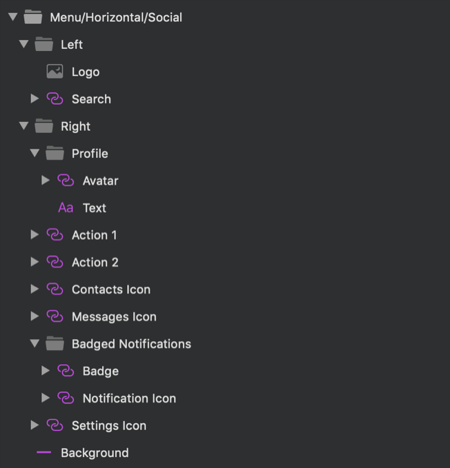

# Menu

Use the Menu Symbols as presets for building navigation bar for application or webpage that contains elements such as logo, menu items, search input, various actions, account settings.

> [!WARNING]
> After inserting any of the Menu Patterns available, you should trigger `Detach from Symbol` to break it down to the Components that are used to create the layout in order to be able to generate it as Angular code. The individual Menu Elements, as well as the background and data binding layers must stay intact and not be detached!

## Additional Resources

Related topics:

- [Input](../components/input.md)
- [Avatar](../components/avatar.md)
  

Our community is active and always welcoming to new ideas.

