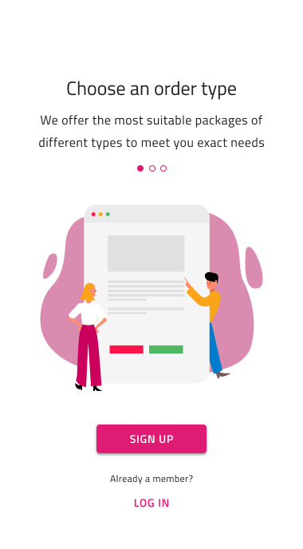

# Onboarding

Use the Onboarding Patterns as presets for building Onboarding experience in several steps. Usually, the onboarding experience is presented in up to 5 steps introducing the most significant application features, details about how to start initially using an application, or an overview of the application screens.

The **Indigo.Design System** provides 7 preset versions of onboarding flows that cover some of the most common application scenarios. However, consider the selection based on the complexity of the information being presented and the user needs.

## Additional Resources

Related topics:

- [Button](../components/button.md)
- [Illustrations](../style/illustrations.md)

Our community is active and always welcoming to new ideas.
