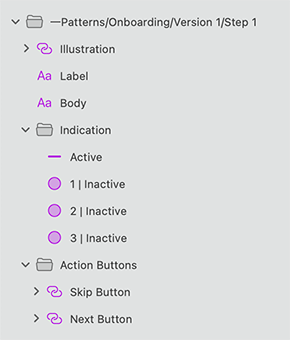

# Onboarding

Use the Onboarding Symbols as presets for building Onboarding experience in several steps. Usually, the onboarding experience is presented in up to 5 steps introducing the most significant application features, details about how to start initially using an application or overview of the application screens.

> [!Note]
> Illustrations nested inside the Pattern Symbols cannot be code generated and Illustration itself has to be inserted manually.

> [!WARNING]
> After inserting any of the Onboarding Patterns available, you should trigger `Detach from Symbol` to break it down to the Components that are used to create the layout in order to be able to generate it as Angular code (except for the illustration which cannot be code generated). The individual Onboarding Elements, as well as the background and data binding layers must stay intact and not be detached!

## Additional Resources

Related topics:

- [Input](../components/input.md)
- [Illustrations](../style/illustrations.md)
- [Text](../components/text.md)
  

Our community is active and always welcoming to new ideas.

