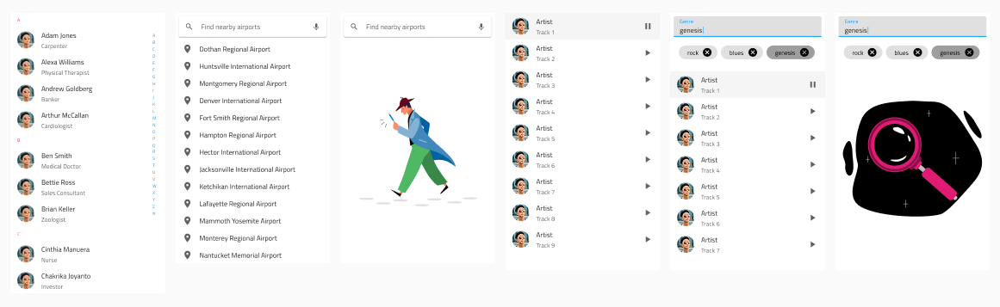

# Patterns Overview

The **Indigo.Design System** boosts your productivity with 180+ UI Patterns assembled from Indigo.Design Components. They are enhanced with the same responsive web design behavior and theming capabilities. The UI Patterns can be found spread across separate pages of the library in Figma and Sketch, while in Adobe XD they are arranged as a column at the right end of the library file:

- 🌆 AV Player
- 🌆 Avatar + Badge
- 🌆 Cards
- 🌆 Chat
- 🌆 Data Visualizations
- 🌆 Details
- 🌆 Dialogs
- 🌆 Empty States
- 🌆 File Upload and Image Manipulation
- 🌆 Footer
- 🌆 Form
- 🌆 Grids
- 🌆 Lists
- 🌆 Menus
- 🌆 Onboarding
- 🌆 Pricing Table
- 🌆 Scheduling
- 🌆 Social Feed
- 🌆 Tiles
- 🌆 User Profile

> [!WARNING]
> Unlike a component, some patterns in the Figma and the Sketch libraries can be detached to show as a group, preserving the look and feel you have defined before that. However, in Adobe XD ungrouping a pattern has devastating implications on the ability to generate code from the resulting layout as it turns all nested components into groups and prevents us from tracing their structure correctly. You can make any state, layout, and styling adjustment in Adobe XD without ungrouping a pattern so we kindly advise you to keep the entirety of these patterns on your artboards. Also bear in mind that in Figma, Sketch and Adobe XD, unlinking a pattern from the library makes it impossible to apply updates from subsequent versions of the Design System automatically.

 Below is a snippet of some of the [list patterns](lists.md) such as a contacts list, searchable and filterable lists, and list empty states when no matching results are found.

  

    

We constantly improve our patterns by adding new ones or by upgrading their structure. You may also create your own Patterns from interface layouts that you use over and over again in your designs, extending our default set and giving your design productivity a further boost. 

## Additional Resources

Related topics:

- [Styling](../style/styling-overview.md)
- [Components](../components/components-overview.md)
  

Our community is active and always welcoming to new ideas.
