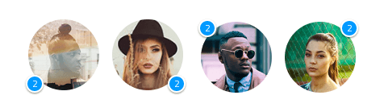
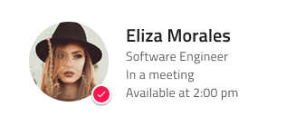
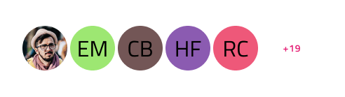
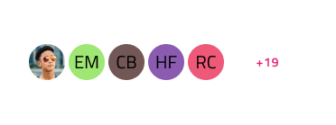

# Persona

The Persona Pattern is a commonly used in many digital platforms to represent users and their accomplishments or roles. An avatar is a small graphical representation of a user, often a profile picture or icon, while a badge is a small visual element that is used with a short subtle message or indication to represent an achievement, alert or a status.

The Persona Pattern comes with the styling flexibility provided by the Avatar and Badge that constitute its layout.

## Size

The Persona Pattern supports the same sizes that the Avatar does:

- Large - Suitable for profile pages
- Medium - Appropriate for custom menus and visualizations
- Small - Easily embedded in a contact list and similar repetitive scenarios

## Position

The Badge comes positioned in one of the four corners of the Avatar as shown below.

- Bottom Left
- Bottom Right
- Top Left
- Top Right

## Persona Details

The Persona Pattern offers varying levels of details based on the size of the avatar being used.

## Persona Facepile

Facepile is a widely used design element in digital platforms that visually represents a group of users or people. It typically displays a set of Avatar component in a compact and aesthetically pleasing format. Notably, Facepile supports the same sizes that the Avatar does: Large, Medium and Small.

## Additional Resources

Related topics:

- [Avatar](../components/avatar.md)
- [Badge](../components/badge.md)

Our community is active and always welcoming to new ideas.