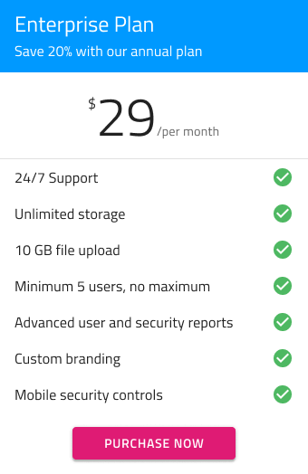
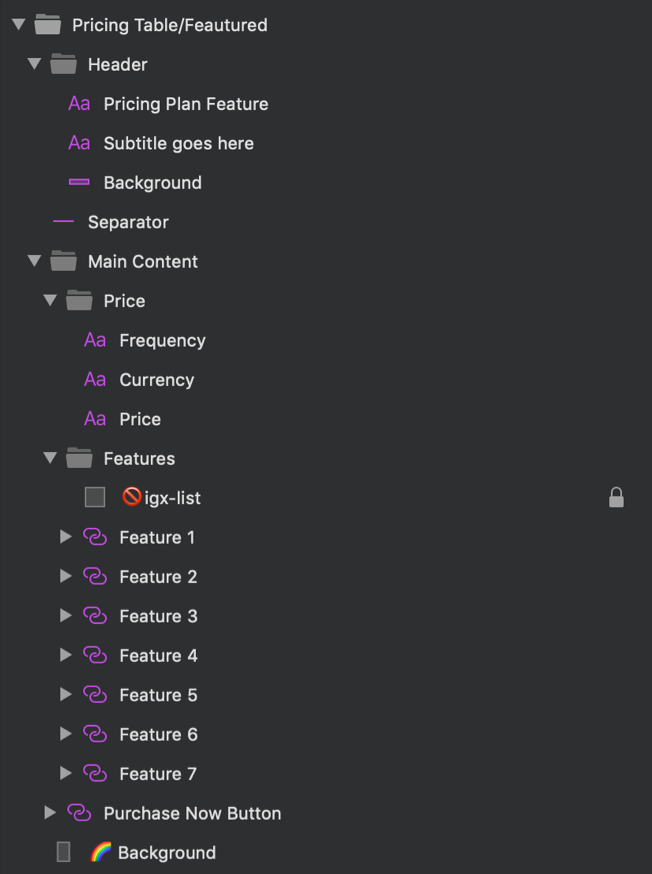

# Pricing Table

Use the Pricing Plan Symbol as presets to display different pricing plans for a product or a subscription. Each Pricing Plan includes plan name, subtitle, price, list of features included or not included and call-to-action button. The Pricing Plan Symbol has two variations - featured and not featured.

> [!WARNING]
> After inserting any of the Pricing Tables available as a Pattern, you should trigger `Detach from Symbol` to break it down to the Components that are used to create the layout in order to be able to generate it as Angular code. The individual Pricing Table Elements, as well as the background and data binding layers must stay intact and not be detached!

## Additional Resources

Related topics:

- [Button](../components/button.md)
- [List](../components/list.md)
  

Our community is active and always welcoming to new ideas.

