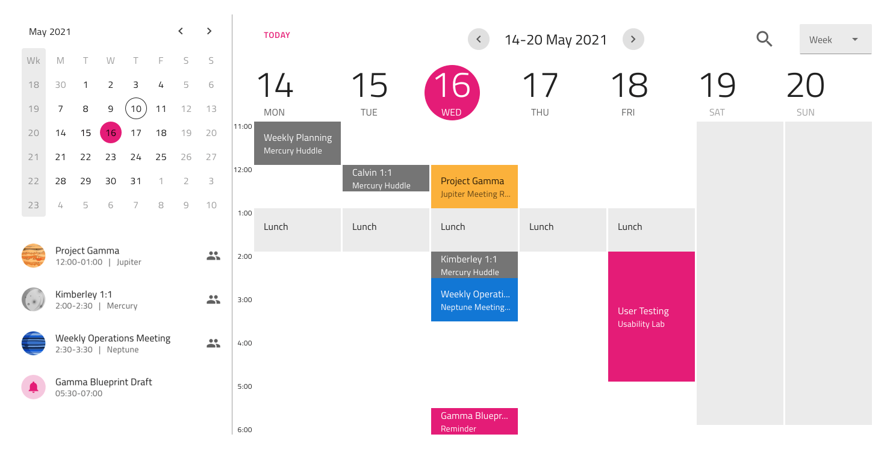
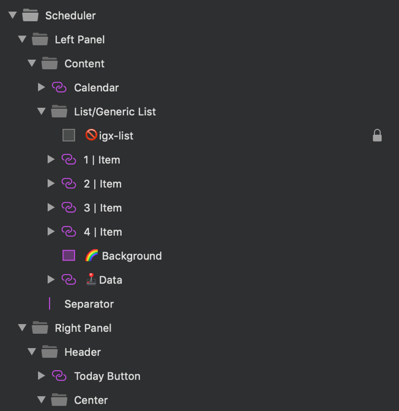

## Scheduler

Use the Scheduler Symbol as a preset to display Scheduler as part of project management, task management, meeting planner or e-mail application. Note that the Scheduler Symbol is just an interface illustrating a scheduler without any of the scheduling functionality.

> [!WARNING]
> After inserting the Scheduler available as a Pattern, you should trigger `Detach from Symbol` to break it down to the Components that are used to create the layout in order to be able to generate it as Angular code. The individual Scheduler Elements, as well as the background and data binding layers must stay intact and not be detached!

## Additional Resources

Related topics:

- [Calendar](../components/calendar.md)
- [List](../components/list.md)
- [Input](../components/input.md)
- [Button](../components/button.md)
  

Our community is active and always welcoming to new ideas.

