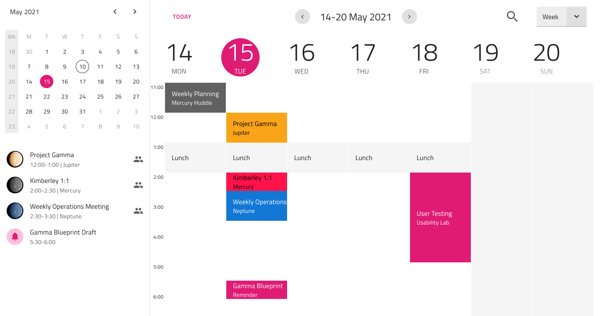

# Scheduler

Use the Scheduler Pattern as a preset to display a scheduler as part of project management, task management, meeting planner, or e-mail application. Note that the Scheduler Pattern is just an interface illustrating a scheduler without any of the scheduling functionality.

## Additional Resources

Related topics:

- [Calendar](../components/calendar.md)
- [List](../components/list.md)
- [Button](../components/button.md)
- [Combo](../components/combo.md)
- [Icon](../components/icon.md)
  

Our community is active and always welcoming to new ideas.

