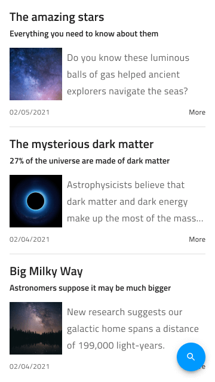

# Social Feed

Use the Social Feed Pattern to display different social content types such as news articles, blog posts, social media posts, comments section using text, images, videos, etc. Social Feed Patterns suitable for mobile and desktop device screen sizes are provided.

## Additional Resources

Related topics:

- [Avatar](../components/avatar.md)
- [Button](../components/button.md)
- [Icon](../components/icon.md)
- [Input](../components/input.md)
- [Navbar](../components/navbar.md)
- [Tabs](../components/tabs.md)
  

Our community is active and always welcoming to new ideas.
