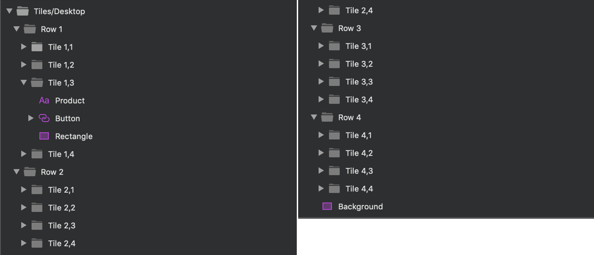

# Tiles

Use the Tiles Pattern to display an overview of products with some of their assets, such as images and product names, as well as application features, recent items, list of items or as a rich-data dashboard.

> [!WARNING]
> After inserting the Tiles Pattern, you should trigger `Detach from Symbol` to break it down to the Components that are used to create the layout in order to be able to generate it as Angular code. The individual Avatars, Buttons, and other components together with the background layers must stay intact and not be detached!

## Additional Resources

Related topics:

- [Button](../components/button.md)
  

Our community is active and always welcoming to new ideas.

