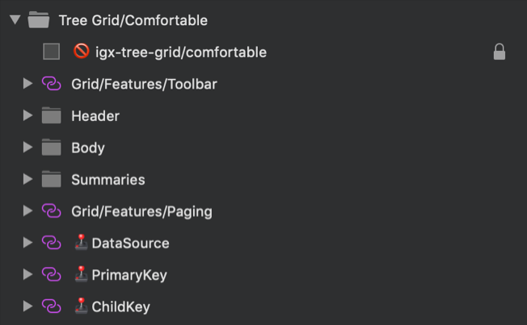

# Tree Grid

Use the Tree Grid Pattern symbol as an alternative starting point when designing a tabular data layout with child and parent records within a Grid. It provides a full-blown contentwise and stylewise Tree Grid Component, on which can be applied all the Grid functionality, provided in the Components Library.

List of all the Grid functionality:
- Sorting
- Filtering
- Summaries
- Paging
- Editing
- Column Moving
- Column Resizing
- Column Hiding
- Display Density
- Excel Style Filtering
- GroupBy
- Pinning
- Row Selection
- Row Editing
- Active Cell
- Export
- Toolbar

All Grid features are applicable to the Tree Grid Pattern.

> [!WARNING]
> After inserting the Tree Grid Pattern, you should trigger `Detach from Symbol` to break it down to the Components and Grid symbols that are used to create the layout in order to be able to generate it as Angular code. The individual Components and Grid symbols, however, must stay intact and not be detached!

## Additional Resources

Related topics:

- [Tree Grid](../components/tree-grid.md)

Our community is active and always welcoming to new ideas.

