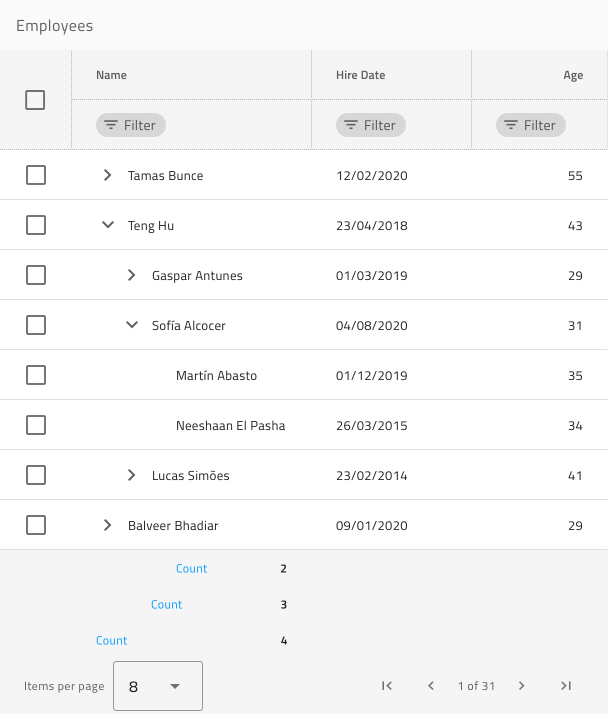

# Tree Grid

Use the Tree Grid Pattern as an alternative starting point when designing a tabular data layout with parent-child relationship between the records. It provides a full-blown contentwise and stylewise Tree Grid Component, on which all the Grid functionality, provided in the Components Library can be applied.

List of all the Grid functionality:
- Sorting
- Filtering
- Summaries
- Paging
- Editing
- Column Moving
- Column Resizing
- Column Hiding
- Display Density
- Excel Style Filtering
- Advanced Filtering
- GroupBy
- Pinning
- Row Selection
- Row Editing
- Active Cell
- Export
- Toolbar

All Grid features are applicable to the Tree Grid Pattern.

> [!WARNING]
> In Sketch, after inserting the Tree Grid Pattern, you can trigger `Detach from Symbol` only if you need to alter the number of cells provided, in order to show all the dimensions of your data and insert as many visible records as you want. The individual Components and Features, however, must stay intact and not be detached!
>
> In Adobe XD you can add more cells than provided by duplicating columns and rows without ever having to ungroup the pattern component itself.

## Additional Resources

Related topics:

- [Tree Grid](../components/tree-grid.md)

Our community is active and always welcoming to new ideas.

