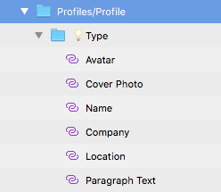

## User Profile

Use the User Profile Pattern to display user-related information, either as a full-screen detailed page or as a small indication that can be inserted in headers and toolbars.

An editable variant of the User Profile Pattern, nicely laid out with the appropriate Inputs, is also provided. The User Profile Pattern comes with the styling flexibility provided by the Avatar, Text, and Inputs that constitute its layout.

> [!WARNING]
> After inserting any of the Profiles available as a Pattern and choosing the `💡State` or `💡Type` (depending on the Pattern inserted) `Override` settings that take care of the Pattern layout, you should trigger `Detach from Symbol`. Then repeat this action one more time on the `💡State` or `💡Type` symbol that will be unveiled in order to be able to generate the Pattern as Angular code. The various Components that lay out the detached `💡State` or `💡Type`, however, must stay intact and not be detached!

## Additional Resources

Related topics:

- [Avatar](../components/avatar.md)
- [Text](../components/text.md)
- [Input](../components/input.md)
  

Our community is active and always welcoming to new ideas.

- [Indigo Design **GitHub**](https://github.com/IgniteUI/design-system-docfx)
