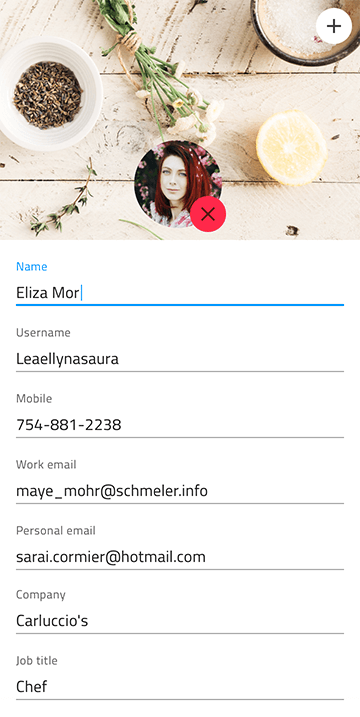

# User Profile

Use the User Profile Pattern to display user-related information, either as a full-screen detailed page or as a small indication that can be inserted in headers and toolbars.

An editable variant of the User Profile Pattern, nicely laid out with the appropriate Inputs, is also provided. The User Profile Pattern comes with the styling flexibility provided by the Avatar and Inputs that constitute its layout.

## Additional Resources

Related topics:

- [Avatar](../components/avatar.md)
- [Button](../components/button.md)
- [Input](../components/input.md)
- [File Upload Pattern](file-upload.md)
  

Our community is active and always welcoming to new ideas.

