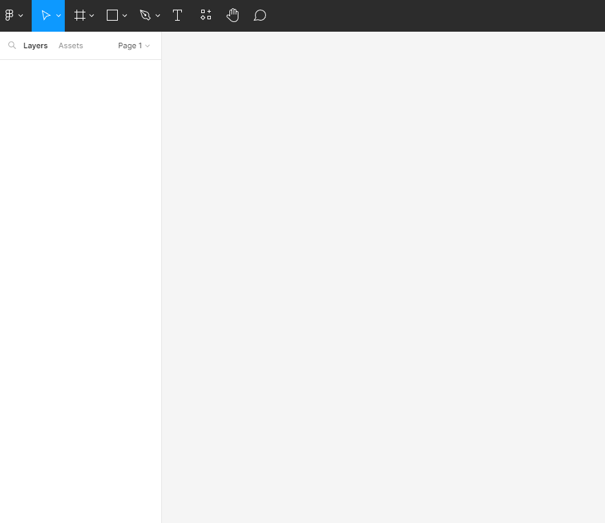
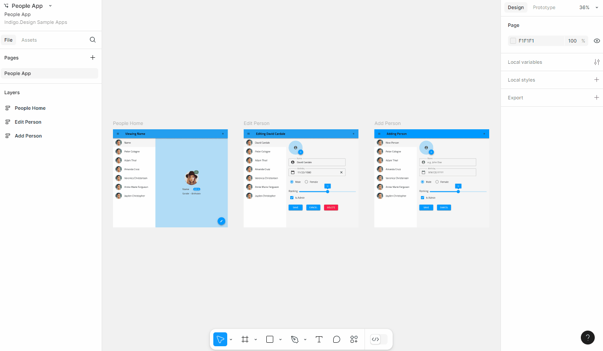
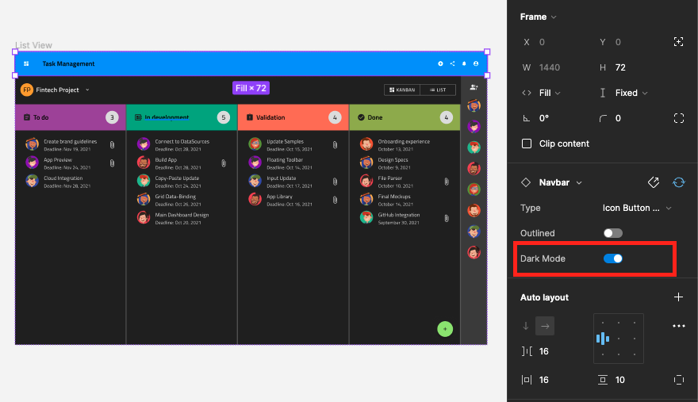
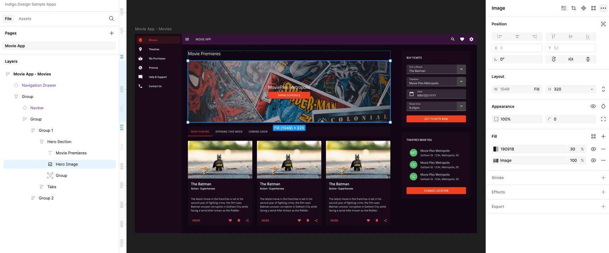
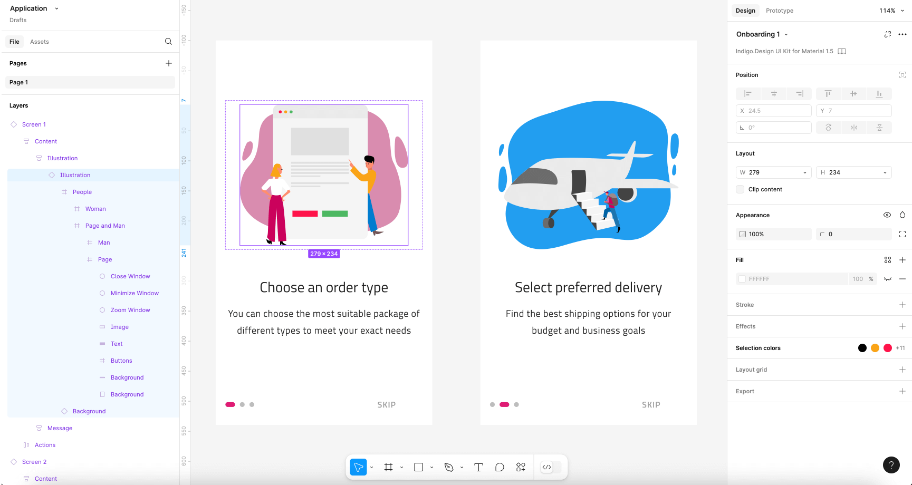
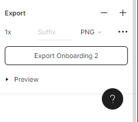

# Indigo.Design Figma Plugin

The Indigo.Design Figma Plugin allows you to quickly turn your design to a full app inside the Indigo Design App Builder.

Once you have created your design using the Indigo.Design UI kit library component, which can be downloaded from [here](https://www.figma.com/@infragistics), you can then export it using the plugin.

It allows you to quickly create an app in Indigo.Design App Builder. This app follows the structure of the Figma design, mapping any component from the Indigo.Design UI kit to the corresponding component from Ignite UI. The plugin also takes the images used in Figma and uploads them in the Assets library under App Builder, benefiting from [`Assets` support](https://www.infragistics.com/community/blogs/b/jason_beres/posts/indigo-design-app-builder-october-release-with-assets-support).

## 1. Installing the Indigo.Design Figma Plugin

The Indigo.Design Figma Plugin is available from Figma's community Plugin's list. 

 You can also find it [here](https://www.figma.com/community/plugin/1462024243431691008/indigo-design-figma-plugin).

## 2. Create an application in App Builder

Once you're ready with the design in Figma you can create an app from it using the `Create New App` feature of the plugin. You can choose a name and a resolution for your app, as well as select the Indigo.Design Cloud workspace, where the app will be created:

## 3. Themes

### Setting global theme

The global theme in Indigo.Design System for Figma could be either dark or light. The Indigo.Design Figma Plugin sets the default theme based on the `Dark Mode` variation of the Indigo.Design library components.

It is applied with the help of heuristic which calculates the count of the components in the Figma file with dark and light variations. If more components have `Dark Mode` enabled then a dark theme is set.

### Color handling

Indigo.Design UI kit for Figma contains five palettes with 10 color variations for each of the `primary`, `secondary`, `grays`, and two chart `series` colors, as well as special colors such as `success`, `warn`, `error`, `info` and `surface`. All those colors can be applied either as a Fill or a Stroke color. 
If a color is mentioned in the table below, then the App Builder will show it with its name (e.g. `primary-900`). All other colors will show as HEX/RGB value.

| Primary | Secondary |  Gray   | Surface | Error | Success | Warn  | Info  |
| :-----: | :-------: | :-----: | :-----: | :---: | :-----: | :---: | :---: |
| 100-900 |  100-900  | 100-900 |   500   |  500  |   500   |  500  |  500  |

## Assets

Any images or illustrations used in a design are send as assets to the App Builder and will appear in the related Assets tab of the generated application.

There are 2 types of images, either simple flat image or a more complex vector based illustration.

### Image

A simple flat image in Figma is typically added as a rectangle shape with image fill:

This will either be interpreted as an `` element with reference to the related image asset, or a group (`
`) with `background-image`, in case it was used as a background for other elements in the design.

### Illustration

Designers often use custom vector and shapes to build an illustration image with the intention of providing it as an image asset.

These can have a complex structure consisting of many groups and vectors:

The designer can specify the exported image type of the illustration via the Export tab in Figma:

It can be PNG, JPG or SVG.

In case no export option is specified but there are vectors detected on the page the plugin will attempt to determine the most probable layer from which the illustration starts. It will attempt to find the closest parent that contains image-like elements only (Vectors, Shapes etc.) and will stop if it finds anything that is not an image element (like Text, Component Instances etc.). Once the bounds of the illustration are determined, its content will be exported in SVG format.

Note that this might not be optimal way to group the vectors so it's always best to mark complex illustrations for export using the Export options in Figma.

## Additional Resources

Related topics:

- [Colors](../style/colors.md)
- [Typography](../style/typography.md)

Our community is active and always welcoming to new ideas.