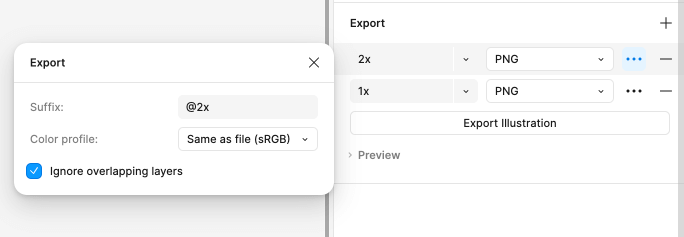

# Indigo.Design Figma Plugin

The Indigo.Design Figma Plugin allows users to quickly create and publish apps in the Indigo.Cloud App Builder from their design.

Once you have created your design using the Indigo.Design UI kit library component, which can be downloaded from [here](https://www.figma.com/@infragistics) you can then export your design using the plugin.

It allows you to quickly create an app in Indigo.Design AppBuilder. This app follows the structure of the Figma design, mapping any symbol from the Indigo.Design UI kit to the corresponding component from Ignite UI. The plugin also takes the images used in Figma and uploads them in the Assets library under AppBuilder, benefiting from [`Assets` support](https://www.infragistics.com/community/blogs/b/jason_beres/posts/indigo-design-app-builder-october-release-with-assets-support).  

## 1. Installing the Indigo.Design Figma plugin

The Indigo.Design Figma Plugin is available from Figma's community Plugin's list. 

 You can also find it [here](https://www.figma.com/community/plugin/1170035114372031474).

## 2. Create an application in AppBuilder

Once you're ready with the design you can create an app from it using the plugin:

## Assets

Any images or illustrations used in a design are send as assets to the App Builder and will appear in the related Assets tab of the generated application.

There are 2 type of images, either simple flat image or a more complex vector based illustration.

### Image

A simple flat image in Figma is typically added as a rectangle shape with image fill:

This will either be interpreted as an `` element with reference to the related image asset, or a group (`div`) with `background-image`, in case it was used as a background for other elements in the design.

### Illustration

Designers often use custom vector and shapes to build an illustration image with the intention of providing it as an image asset.

These can have a complex structure consisting of many groups and vectors:

The designer can specify the exported image type of the illustration via the Export tab in Figma:

It can be PNG, JPG or SVG.

In case the layer's export option is not specified the plugin will export the illustration as SVGs in the App Builder.

## Additional Resources

Related topics:

- [Colors](../style/colors.md)
- [Typography](../style/typography.md)

Our community is active and always welcoming to new ideas.