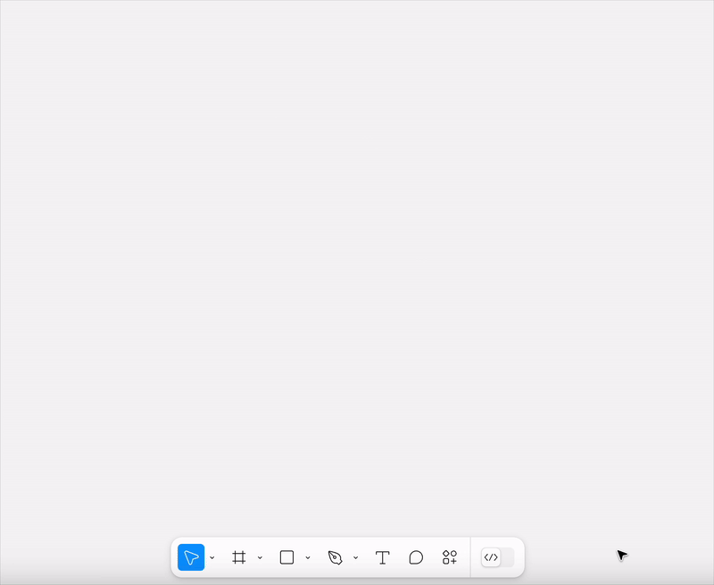

# Indigo.Design Figma Plugin

The Indigo.Design Figma Plugin allows users to quickly create and publish apps in the Indigo.Cloud App Builder from their design.

Once you have created your design using the Indigo.Design UI kit library component, which can be downloaded from [here](https://www.figma.com/@infragistics) you can then export your design using the plugin.

It allows you to quickly create an app in Indigo.Design AppBuilder. This app follows the structure of the Figma design, mapping any symbol from the Indigo.Design UI kit to the corresponding component from Ignite UI. The plugin also takes the images used in Figma and uploads them in the Assets library under AppBuilder, benefiting from [`Assets` support](https://www.infragistics.com/community/blogs/b/jason_beres/posts/indigo-design-app-builder-october-release-with-assets-support).  

## 1. Installing the Indigo.Design Figma plugin

The Indigo.Design Figma Plugin is available from Figma's community Plugin's list. 

 You can also find it [here](https://www.figma.com/community/plugin/1170035114372031474).

## 2. Create an application in AppBuilder

Once you're ready with the design you can create an app from it using the plugin:

## 3. Themes

### Setting global theme

The global theme in Indigo.Design System for Figma could be either dark or light. The Indigo.Design Figma Plugin sets the default theme based on the `Dark Mode` variation of the Indigo.Design library components.

It is applied with the help of heuristic which calculates the count of the components in the Figma file with dark and light variations. If more components have `Dark Mode` enabled then a dark theme is set.

### Color handling

Indigo.Design UI kit for Figma contains five palettes with 10 color variations for each of the `primary`, `secondary`, `grays`, and two chart `series` colors, as well as special colors such as `success`, `warn`, `info` and `surface`. All those colors can be applied either as a Fill or a Stroke color. 
If a color is mentioned in the table below, then the App Builder will show it with its name (e.g. `primary-900`). All other colors will show as HEX/RGB value.

| Primary | Secondary |  Gray   | Surface | Error | Success | Warn  | Info  |
| :-----: | :-------: | :-----: | :-----: | :---: | :-----: | :---: | :---: |
| 100-900 |  100-900  | 100-900 |   500   |  500  |   500   |  500  |  500  |

## Additional Resources

Related topics:

- [Colors](../style/colors.md)
- [Typography](../style/typography.md)

Our community is active and always welcoming to new ideas.