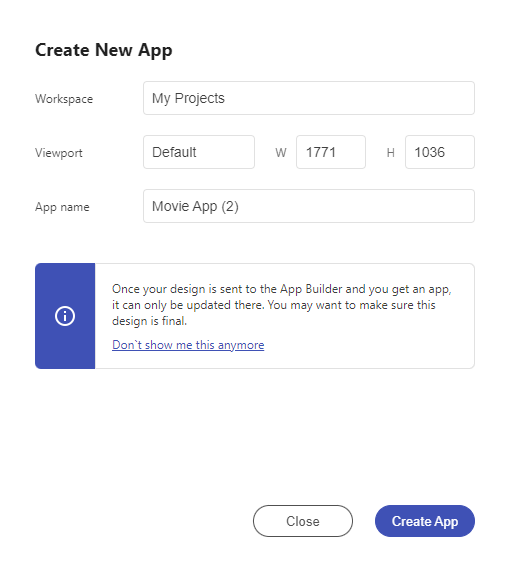

# Overview

The Indigo.Design Plugins for Figma, Sketch and XD allow you to quickly turn your design to a full app inside the Indigo Design App Builder.

Take your designs and create interactive, responsive apps with real UI components and styling. Use the `Create New App` feature of the plugins to transform your Figma, Sketch and Adobe XD designs into a real applications under the AppBuilder, allowing access to the images and themes - all of this directly in the cloud.

> Note: The Plugins require the user to log in with their [Infragistics account](https://www.infragistics.com/) or create a new one and to have an Indigo.Design Trial or [subscription plan](https://www.infragistics.com/products/indigo-design/pricing).

The plugins allow you to choose a name and resolution for your app, as well as to select the Indigo.Design Cloud workspace, where the app will be created.

There's a plugin for each design tool you can refer to:
- [Figma](../plugins/figma-plugin.md)
- [Sketch](../plugins/sketch-plugin.md)
- [Adobe XD](../plugins/xd-plugin.md)

## Additional Resources

Related topics:

- [Colors](../style/colors.md)
- [Typography](../style/typography.md)

Our community is active and always welcoming to new ideas.