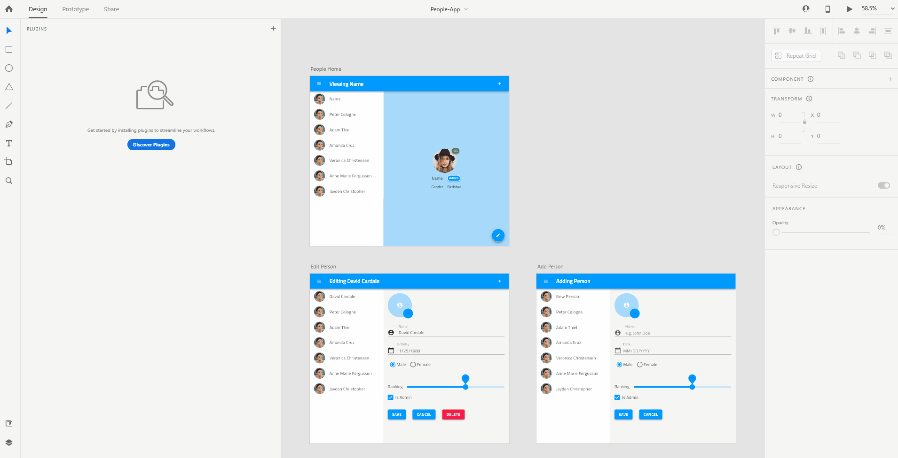

# Indigo.Design XD Plugin

The Indigo.Design XD Plugin allows users to quickly create and publish apps in the Indigo.Cloud App Builder from their design.

Once you have created your design using the Indigo.Design UI kit library component, which can be added as a public library from [here](https://assets.adobe.com/public/c1a672c5-49e6-4df1-4d32-1c37fa234f1e) you can then export your design using the XD plugin.

It allows you to quickly create an app in Indigo.Design AppBuilder. This app follows the structure of the XD design, mapping any symbol from the Indigo.Design UI kit to the corresponding component from Ignite UI. The plugin also takes the images used in XD and uploads them in the Assets library under AppBuilder, benefiting from [`Assets` support](https://www.infragistics.com/community/blogs/b/jason_beres/posts/indigo-design-app-builder-october-release-with-assets-support).  

## 1. Installing the Indigo.Design plugin

The Indigo.Design Plugin is available from Adobe's market place. You can add it from your XD's Plugins menu:

Or you can directly access it [here](https://exchange.adobe.com/apps/cc/92c7dec5).

## 2. Create an application in AppBuilder

Once you're ready with the design you can create an app from it using the plugin:

## Additional Resources

Related topics:

- [Colors](../style/colors.md)
- [Typography](../style/typography.md)

Our community is active and always welcoming to new ideas.
