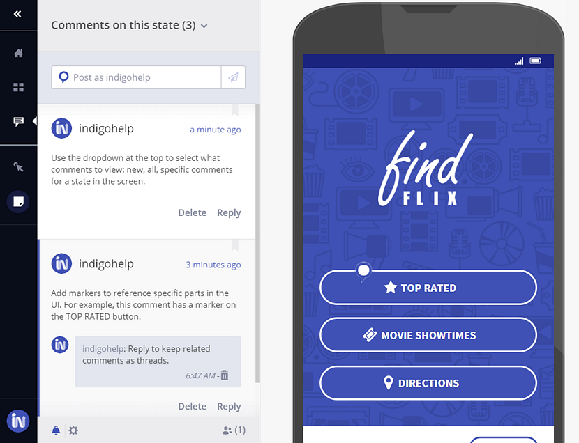

##  Commenting on Prototypes

Prototypes you publish have support for real-time commenting. 

Anyone you share the prototype link with can use the commenting panel in the prototype viewer and also subscribe to receive email notifications when new comments are added to the prototype.

To enable comments for your prototype you can use the settings section in the commenting panel of the prototype viewer toolbar, or the review and commenting options in the detail panel of your prototype.

You can add markers to your comments to visually connect a comment with the UI. Click on the marker and then click on the area where you want to place it over the design. Then, add your comment.

> [!Note]
>Commenting is not supported for community prototypes.

### Commenting options

Goal | Action
------------- | -------------
Allow reviewers to add new comments | Set the share to open for commenting
Stop reviewers from adding new comments | Set the share to closed for commenting
Hide a comment from reviewers | Archive comment
Get or stop receiving email notifications | Turn notifications on/off

##  Learn More

- [Collaborating with Group Workspaces](workspaces.md)