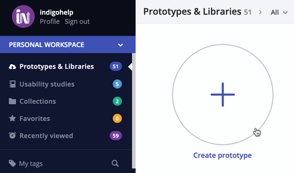
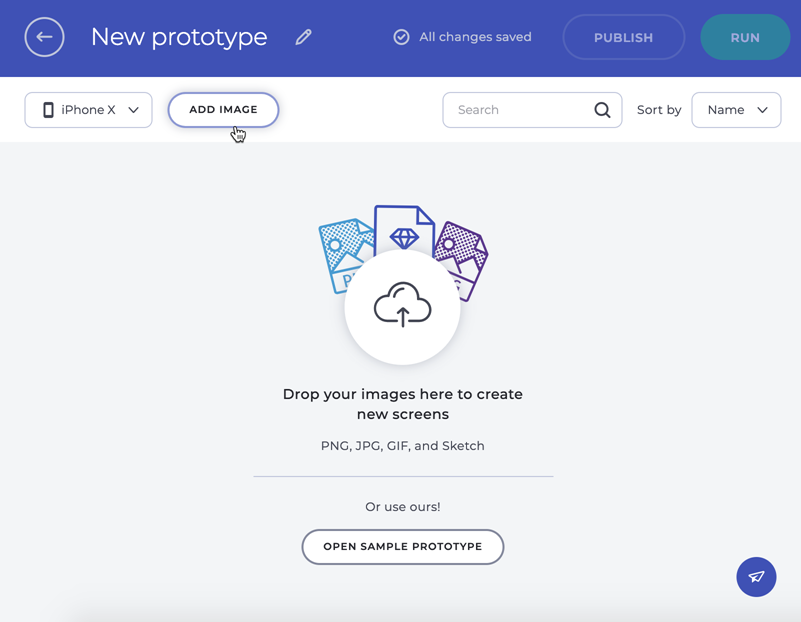
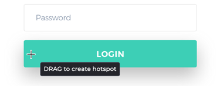
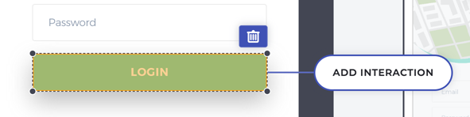
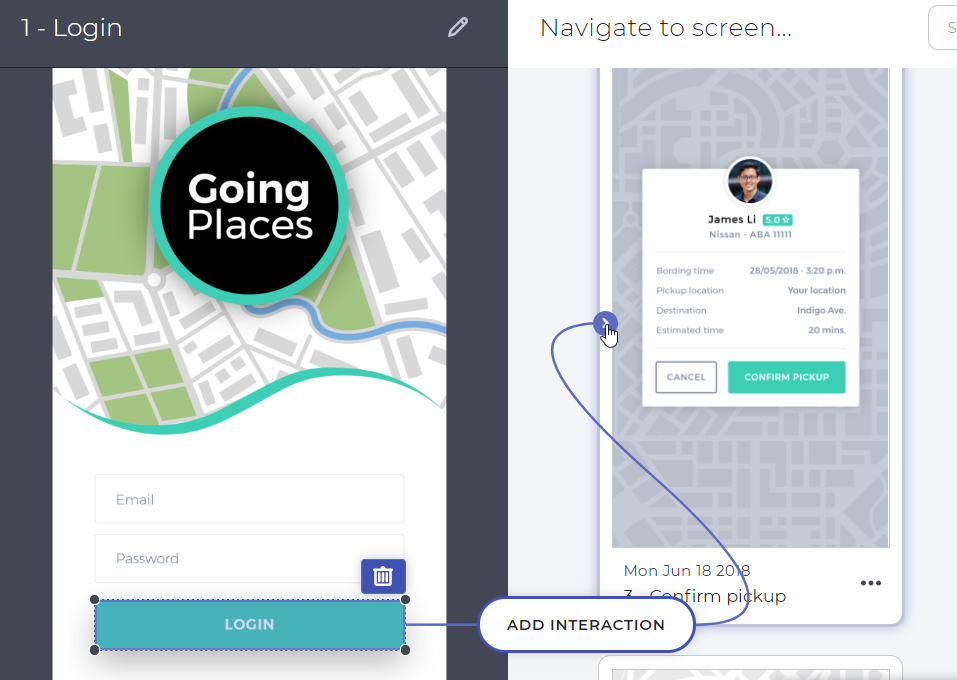
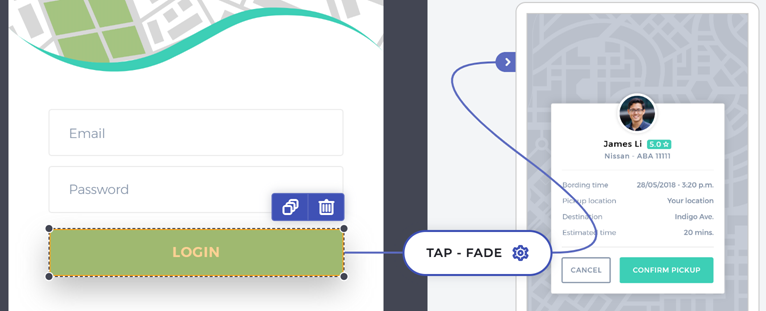
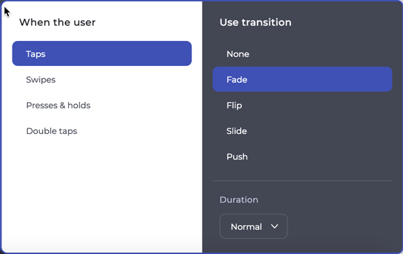
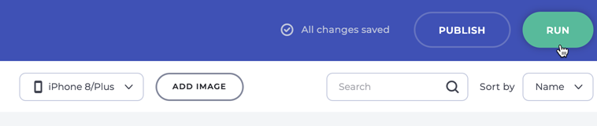
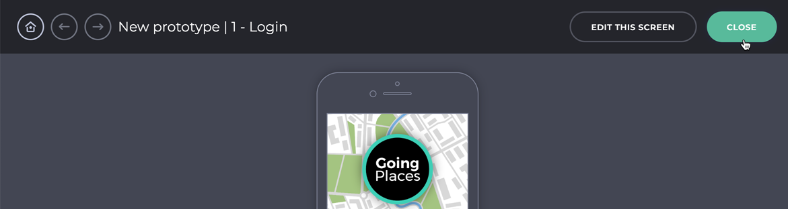
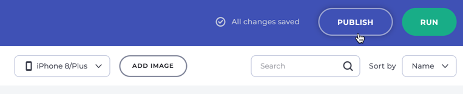

## Creating Your First Prototype

Create a prototype and publish it to validate flows with stakeholders and users.

## Step by step

### 1. Create a new prototype

Select the item with the plus icon from your prototype and library list to create a new prototype.

### 2. Add images

You can either drop images to the designer or click the ADD IMAGE button to pick files from your computer.  
Once you add them, your images become screens in your prototype.

You can also add a Sketch project and Sketch Artboards will become screens.

### 3. Add interactions

1.  Select a screen to load it on the panel on the left.
2.  Click and drag over an area of the screen to create a hotspot.
    

    
    

    

    

    

    

3.  Click the ADD INTERACTION button.
      

      
      

      

      

      

      

    The connector appears.
4.  Choose one of the other screens in the panel on the right and click on it.
    

    
    

    

    

    

    

    By default, this creates a TAP interaction with a FADE animation to navigate to the screen you chose in step 4.
    

    
    

    

    

    

    

Click on the interaction to display the interaction panel. Use it to change the user action that triggers the navigation, the animation for the transition, and the duration of the transition.

Learn more about [interaction options][topic-1].

Add as many interactions as you need until your prototype is complete.

### 4. Preview the prototype

1.  Click the RUN button.
    

    
    

    

    

    

    

    This opens the preview mode.
2.  Interact with your prototype.
3.  Click the CLOSE button.
    

    
    

    

    

    

    

    This will bring you back to the designer.

### 5. Publish the prototype

1.  Click the PUBLISH button.
    

    
    

    

    

    

    

2.  You'll get a link that you can share for people to view your prototype.

You're ready to have reviewers comment on your prototype and to have users validate your flows by taking part in usability studies.

[a-1]: #1-create-a-new-prototype
[a-2]: #2-add-screens
[a-3]: #3-add-interactions
[a-4]: #4-preview-the-prototype
[a-5]: #5-publish
[topic-1]: interaction-options.md
