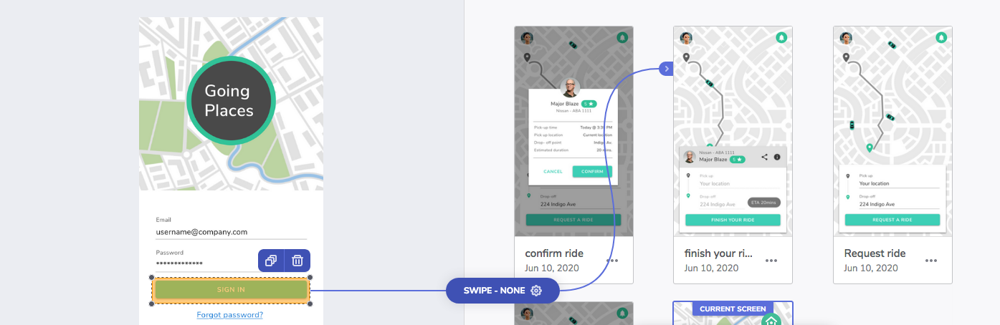
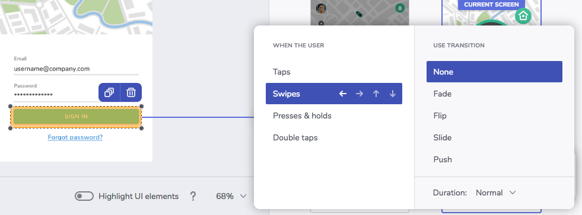
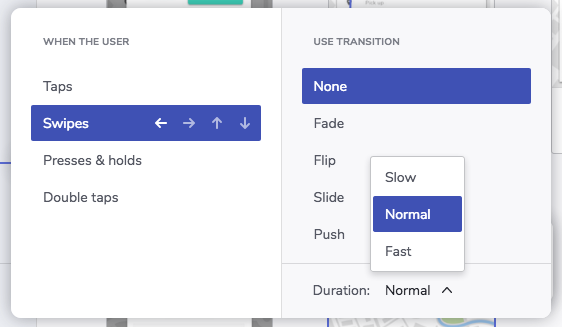

## Additional Interaction Options

In this topic you can find information about interactions. These are the main concepts:

- [Hotspots][a-1]
- [User actions][a-2]
- [Navigations][a-3]
- [Transitions][a-4]

Also, check out [Creating A Prototype][topic-1] to learn how to create and publish a prototype.

## Hotspots

Hotspots are areas in your screens users can then interact with to trigger navigations in your prototype.

### Creating hotspots

To create a hotspot, CLICK + DRAG over any point in your screen.

If you want to create an overlapping hotspot, use CTRL + CLICK + DRAG.

### Duplicating hotspots

Sometimes there's an interaction that you want to repeat across several screens in your prototype.
To do that, create a hotspot, add an interaction, and then duplicate it.

## User actions

Interactions are the user actions that trigger navigations in the prototype.

### What does the user do?

You can choose between:

- Tap
- Swipe
- Press & hold
- Double tap

## Navigations

What happens in the prototype once the user interacts with it?

### Navigate to another screen

The most frequent interaction is to navigate to another screen in the prototype.

### Go back

Navigate to the previous screen in the navigation history for the prototype.

### Open URL

Navigate to any URL outside the prototype.

## Transitions

Pick an animation for transitions between screens in your prototype, or choose not to have an animated transition.

- None
- Fade
- Flip
- Slide
- Push

The flip, slide, and push animations also have different directions.

### Durations

Pick any of these durations for transitions between screens.

- Slow: 450 milliseconds
- Normal: 300 milliseconds
- Fast: 150 milliseconds

[topic-1]: creating-a-prototype.md
[a-1]: #hotspots
[a-2]: #user-actions
[a-3]: #navigations
[a-4]: #transitions
