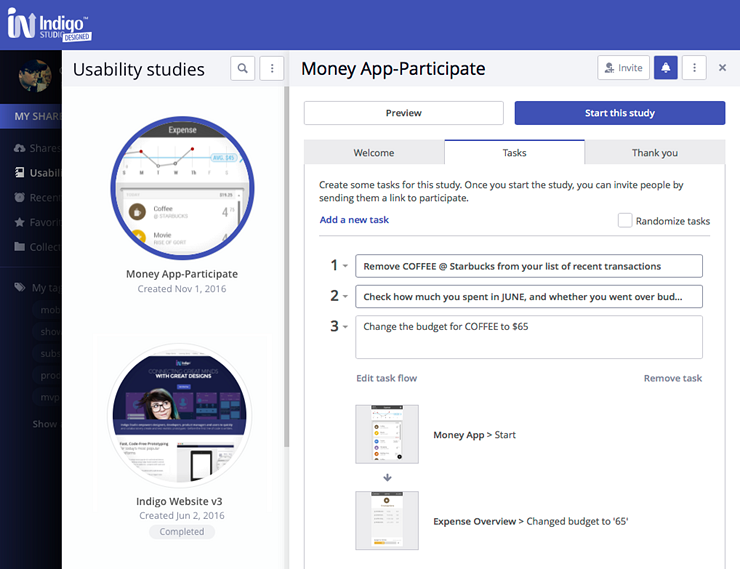
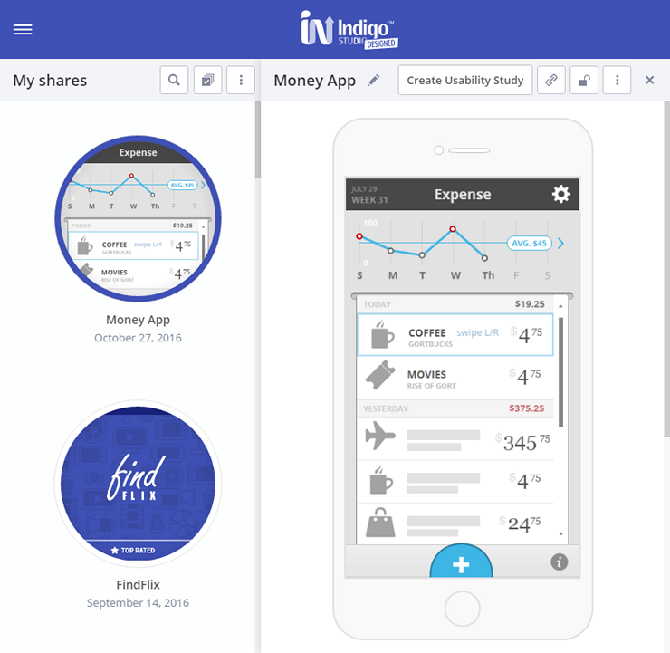
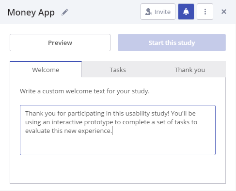
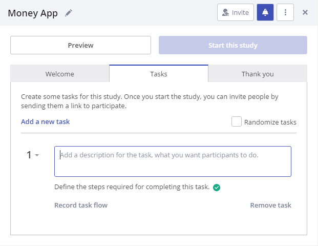

## Setting up a Usability Study

At the end of this topic you'll have a usability study based on a published prototype. Learn about [how to create and publish a prototype][topic-1].

You can also check out our video tutorial.

<iframe width="560" height="315" src="https://www.youtube.com/embed/vilyDL4fDT0?list=PLZ4rRHIJepBuVK59H1W6cOg6foOD5wqii" frameborder="0" allow="autoplay; encrypted-media" allowfullscreen></iframe>

##  Step by step

### Create a usability study

1. Select the published prototype to see its details.

    

    
    

    

    

    

    

2. Click on `Create Usability Study`.

3. Optionally, add welcome and thank you messages.  

    The welcome message is what your participants will see before starting the study.
    For the thank you page content you can suggest future actions for participants completing the study. For example, asking them to go complete a post-study survey.

    

    
    

    

    

    

    

> [!Note]
>Select `Usability Studies` in the navigation bar while signed in to see and manage all your studies.

### Define tasks

You need at least one task to start a study.

1. To add a task, click on `Add a new task`. Then, add a description.

    

    
    

    

    

    

    

    You won't be there to moderate, so the way you phrase your tasks and the detail in the prototype may influence the outcome of the study.

2. Start recording the flow.

    Click on `Record a flow`.
    This launches the prototype and the recording interface to define the steps the participant needs to take to complete that task.
 
3. Mark the starting point. 

    By default, you'll view the start state first. Depending on the task, you may select any state as the starting point.

    

    
    

    

    

    

    

4. Interact with the prototype to define the following steps.

    If you make a mistake, you can always undo the last step. 

5. Save the task flow. 

    Once you complete the task as you expect your participants to do, save the task flow. And that’s it.

    You can add as many tasks as you want.

> [!Note]
>You can restrict interactions with the prototype so participants can only follow steps you defined when recording the task flow. To do this, use the `Disable interactions outside the recorded task flow` checkbox.

### Invite participants

1. Click the `Start this study` button.

2. Use the `Invite` option to get a direct link to share so people can participate.

> [!Note]
>Once participation begins, you cannot make changes to your study.

When you are happy with the number of participants, you can close the study to prevent additional sessions.

Read about [usability studies results][topic-2].

[topic-1]: create-a-prototype.md
[topic-2]: usability-study-results-overview.md

[a-1]: #1-create-a-usability-study
[a-2]: #2-define-tasks
[a-3]: #3-invite-participants
