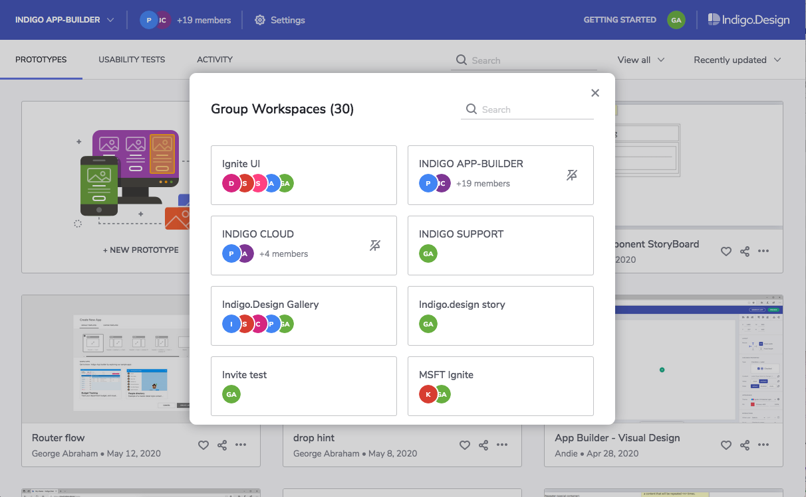
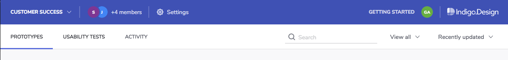

##  Collaborating with Workspaces

Use group workspaces to collaborate with your teammates on the same prototypes and usability studies. Members can publish and replace any design in the workspace. And if a member leaves, the rest will still have access to what's in the workspace.

 

### Creating a Group Workspace

Expand the workspaces dropdown and click the `+ new group` option. 

Type a name for your workspace. 

Add members by typing their email address. 
If you already share workspaces with them, they'll show up on a list. You can select them from the list and they'll become a member immediately. Otherwise, they'll get an invite to join the workspace via email.

 

### Accessing a Workspace

Expand the workspaces dropdown and select the name of the workspace you want to work on.
You'll see all the prototypes and usability tests belonging to that workspace.

### Publishing to a Group Workspace

Once you select a workspace, any prototypes you create and publish will belong to that workspace. 

> [!Note]
>You can choose any prototype and use the `Copy to workspace` action to make a copy of that prototype in a different workspace.

### Managing Group Workspaces

Select the workspace from the workspaces dropdown and then click on `settings` in the main toolbar area.

Option | Description |
------------- | -------------
Edit the workspace name | 
Enable/disable email notifications | Start or stop receiving emails with workspace activity information.
Add/invite members | Select members from the list to add them directly, or type an email to send an invite.
Remove members | The user you remove won't be able to access the workspace or publish designs to it.
Leave the workspace | You won't be able to access the workspace or publish designs to it.
Archive the workspace | No members can publish to this workspace. Any member can restore the workspace.

### Configuring Notifications

Here's a list of the notifications you can receive when you're a member of a workspace and how to configure them.

When do I get it? | How do I configure it? 
------------- | -------------
You're invited to a workspace | It's sent automatically. 
You're added to a workspace |  It's sent automatically.
Someone publishes to the workspace | Enable workspace notifications.
Someone replaces a prototype | Enable workspace notifications.
Someone deletes a prototype | Enable workspace notifications.
Someone archives the workspace | Enable workspace notifications.
There are new comments on a workspace prototype | Subscribe to notifications for the prototype.
There's a new participant in a workspace usability study | Subscribe to notifications for the usability study.

##  Learn More

* [Setting Up a Usability Study][topic-1]

[a-1]: #creating-a-group-workspace
[a-2]: #accessing-a-workspace
[a-3]: #publishing-to-a-group-workspace
[a-4]: #managing-group-workspaces
[a-5]: #configuring-notifications

[topic-1]: setting-up-a-usability-study.md
