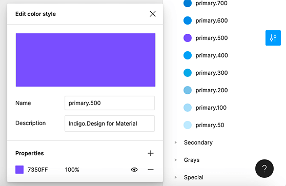
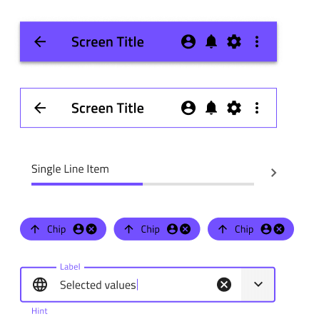
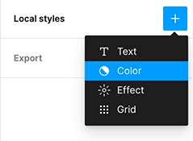
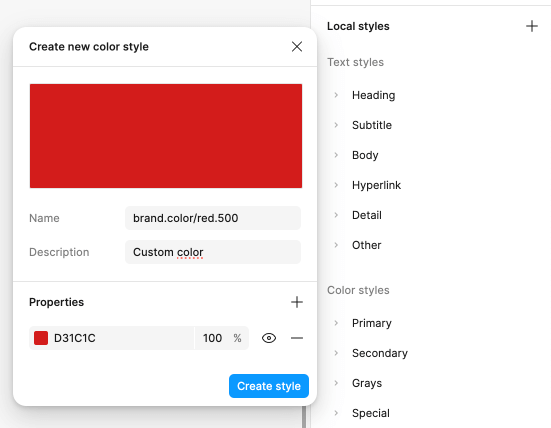
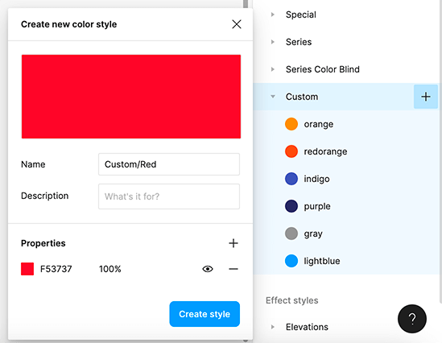

# Colors

There are five palettes with 10 color variations each for the `primary`, `secondary`, `grays`, and two chart `series` colors, as well as special colors such as `success`, `warn`, `error`, `info`, and `surface` in the **Indigo.Design System**. In Figma, we also have 10 color variants for the `success`, `warn`, `error` and `info` states. This lets you change the complete look of the library and all projects that use it with just a few clicks. The way Colors are set up is identical to the [Ignite UI for Angular Themes](https://www.infragistics.com/products/ignite-ui-angular/angular/components/themes.html).

In Figma, they are placed on a separate page called `↳ Colors` and can be applied to any shape element through Color styles, which are positioned under the Design tab in the right sidebar.

The **Indigo.Design System** features special color palettes, optimized for various data visualization scenarios. Both ensure good contrast between adjacent series colors so that the palette can be used e.g. to colorize ranges of a gauge. One of the palettes is further optimized to be 100% inclusive and facilitate easy comprehension by people with color blindness deficiencies. 

## Palette Generation in Figma

To change the primary palette in Figma, you need to first open the **Indigo.Design UI kit** file. In the properties panel you'll see a section called `Color styles`. The color styles are organized into various categories, representing different color variants.

To modify a color, click on the `Edit style` icon, positioned on the right of the color's name. A dialog will be displayed, where you can specify the new color.

After making the desired changes, the color style will be applied automatically to all elements, which currently use it.

This procedure can be applied to each available color style in the **Indigo.Design System**.

## Creating Custom Colors in Figma

There are cases where we need more colors than the ones we have available. There are two approaches for creating custom colors that differ in terms of the scope we do this for.

If you want your added colors to be accessible only within the scope of your current project, you can create local styles within your project. To do so, go to the plus button on the right of the Local styles section, placed in the properties panel. A new contextual menu will be displayed and you need to choose `Color`.

A new dialog will be displayed, where you can set the new color, give it a name and description, relevant to the color's usage in the design project.

If you want the colors you added to be available to all users in your team, you need to create the new styles in the **Indigo.Design UI kit** file, but this time you need to add them under `Custom` colors. You should then publish the changes to make them accessible for your team.

## Additional Resources

Related topics:

- [Elevation](elevation.md)
- [Typography](typography.md)
  

Our community is active and always welcoming to new ideas.
