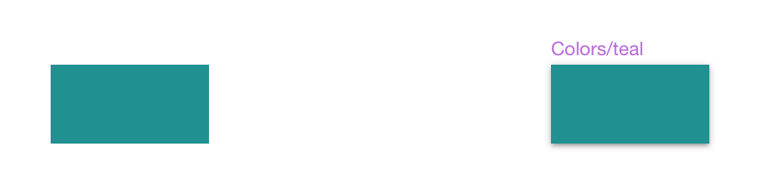
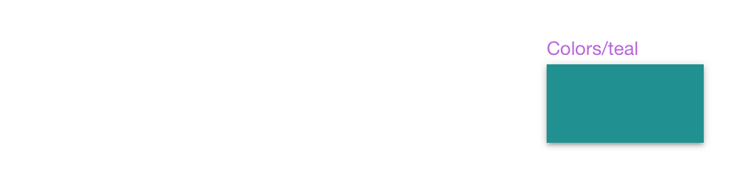

# Colors

On the `🎨 Colors` page of the **Indigo.Design System** you will find a collection of `primary`, `secondary`, `success`, `warn`, `error`, `info`, `grays`, and `series` colors to let you brand the library all at once. The way Colors are set up is identical to the [Ignite UI for Angular Themes](https://www.infragistics.com/products/ignite-ui-angular/angular/components/themes.html).

## Palette Generation

To change the primary palette in Sketch open the Indigo.Design library file and select `View` -> `Components`. Then in the Sketch menu you will notice a group of four buttons, where the one to the right is an icon of a pantone guide and stands for `Show Color Variables`.

On the canvas below you will see a collection of colored circles representing all color variables we have defined in the library. You need to find the one called `primary`, select it and use the panel on the right to specify a different color. You are all set, this change will not only update all variants and `Layer Styles` for the primary palette, but also propagate these changes across all Components and Patterns automatically.

The same procedure can be followed for the `secondary` colors and other colors with special meaning in the library.

## Creating Custom Colors

There are cases where we needs more colors than the ones we have available. There are two approaches for creating custom colors that differ in terms of the scope we do this for.

### Global

If you want your added colors to be available across all the projects that use the library, follow these simple steps:

1.  Navigate to the `Colors` page, and zoom to the empty `Custom` section underneath the `series` palettes.

    

2.  Draw a rectangle and set its fill to the color of your choice. 

    

3.  In the color picker you will notice a `Create Color Variable` button which you need to select once you are happy with your choice.

    

3.  Apply the same color variable to the border of the rectangle and name it accordingly e.g. `cool gray`.

    

4.  Now you have to create three color styles using the custom color rectange: one with just the fill, one with just the border, and one with both naming them accordingly.

    

5.  You are all set, your custom color will appear as a Color Variable and show up in the overrides for your Components and Patterns.

### Local

The second approach describes the addition of file-specific colors, not available across all projects, but only in the current one in which you are working. To achieve that, follow these simple steps:

1.  Open an existing or new Sketch file and create a new page, naming it `Local Styles`.

    

2.  Then, on the new page, insert a `Colors/black` element from the Styling library.

    

3.  Right click it and select `Detach from Symbol` to uncover this symbols-only contained layer called `Rectangle`. Select the `Rectangle` layer and change its Fill to a color of your choice e.g. #008080 (teal).

    

4.  Now, select the group that was formed after selecting `Detach from Symbol` (it should be called `Colors/black`, just like the symbol instance before) and click the `Create Symbol` button from the main Sketch menu at the top to reinstate the modified color as an overridable color symbol. In the prompt that will appear, choose a name for your custom color e.g. `Colors/teal` and make sure the Symbols Page checkbox is unselected before clicking the OK button. This will create the symbol and you should see something like this.

    

5.  Finally, let's do our housekeeping and remove the non-symbol rectangle with teal color, and we are all set. The color you have added should appear as a local symbol in the list of colors under the Document category. It will also show up for the color overrides under `Document/Colors` for all instances of Components and Patterns in the current project, where color is applicable.

    

## Code generation

A color style object when added to a Sketch drawing is rendered as an HTML div with the corresponding color and size.

Once you have set up your branding by adjusting the nuances of the `primary`, `secondary`, `success`, `warn`, `error`, and `info` color symbols, you probably want to achieve the same look for your generated code. Thanks to the robust theming in [Ignite UI for Angular](https://www.infragistics.com/products/ignite-ui-angular), this is possible with only a few lines of code. For a detailed walkthrough on how to create and add a color palette, check out the [Theming Topic](https://www.infragistics.com/products/ignite-ui-angular/angular/components/themes.html#generating-color-palettes). Just remember to insert the correct HEX values from Colors in the Styling Library.

## Additional Resources

Related topics:

- [Typography](typography.md)
  

Our community is active and always welcoming to new ideas.
