# Colors

There are five palettes with 10 color variations each for the `primary`, `secondary`, `grays`, and two chart `series` colors, as well as special colors such as `success`, `warn`, `error`, `info`, and `surface` in the **Indigo.Design System**. This lets you change the complete look of the library and all projects that use it with just a few clicks. The way Colors are set up is identical to the [Ignite UI for Angular Themes](https://www.infragistics.com/products/ignite-ui-angular/angular/components/themes.html).

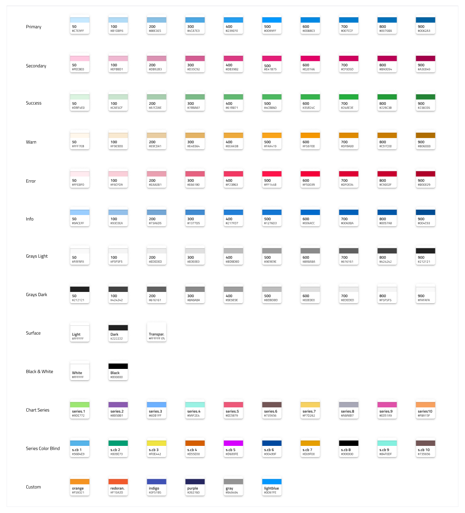

In Sketch, these can be found on a separate page named `🎨 Colors` and are available as `Layer Styles` that can be applied to any shape element. In Adobe XD they are placed on an Artboard with the same name in the left column of the library file and exist as `Colors` that are used across components and patterns.

The **Indigo.Design System** features special color palettes optimized for various data visualization scenarios. Both ensure good contrast between adjacent series colors so that the palette can be used e.g. to colorize ranges of a gauge. One of the palettes is further optimized to be 100% inclusive and facilitate easy comprehension by people with color blindness deficiencies. 

## Palette Generation in Sketch

To change the primary palette in Sketch open the Indigo.Design library file and select `View` -> `Components`. Then in the Sketch menu you will notice a group of four buttons, where the one to the right is an icon of a pantone guide and stands for `Show Color Variables`.

On the canvas below you will see a collection of colored circles representing all color variables we have defined in the library. You need to find the one called `primary`, select it and use the panel on the right to specify a different color. You are all set, this change will not only update all variants and `Layer Styles` for the primary palette, but also propagate these changes across all Components and Patterns automatically.

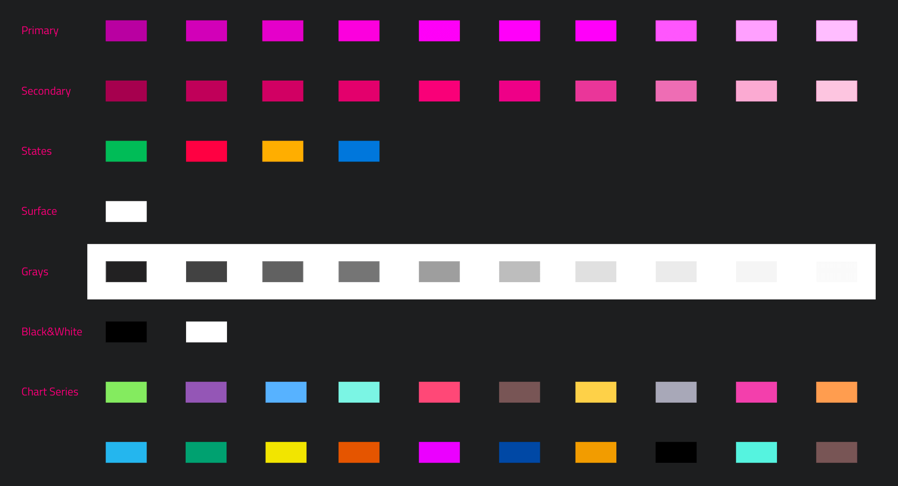

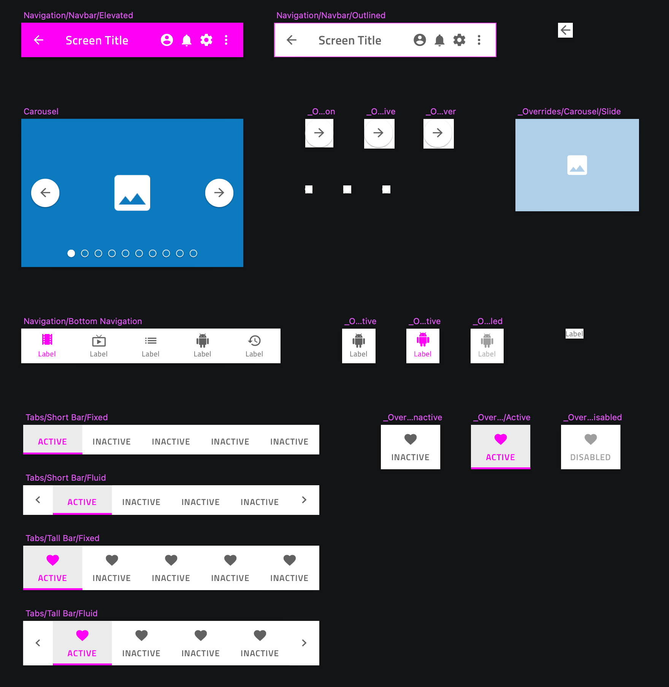

The same procedure can be followed for the `secondary` colors and other colors with special meaning in the library.

## Palette Generation in Adobe XD

To change the primary palette in Adobe XD open the Indigo.Design library file and show the `Libraries` panel. Then, right-click on `primary.500` and choose `Edit` from the contextual menu that appears to specify a different color. You will notice that this will update the palette on the `🎨 Colors` artboard, but only the `primary.500` color in the `Libraries` panel will reflect the change.

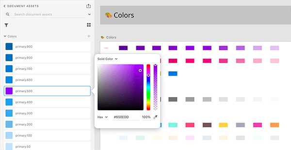

The rest of the colors in the `Libraries` panel have to be updated manually. To achieve this, draw a rectangle and use the eyedropper tool to set its fill by picking a color variant from the palette on the `🎨 Colors` artboard. Then use the hex value to edit the respective color in the `Libraries` panel. Follow this process until the whole palette is updated.

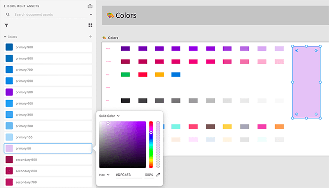

The same procedure can be followed for the `secondary` colors and other colors with special meaning in the library. This will propagate to components and patterns automatically.

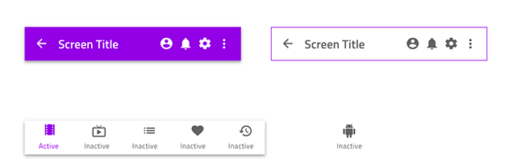

## Creating Custom Colors in Sketch

There are cases where we need more colors than the ones we have available. There are two approaches for creating custom colors that differ in terms of the scope we do this for.

If you want your added colors to be available across all the projects that use the library, navigate to the `Colors` page in it, and zoom to the empty `Custom` section underneath the `series` palettes.

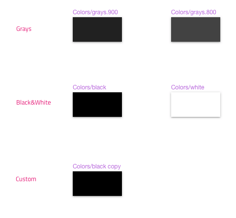

Then complete the steps below to finish the process. If you want your added colors to be accessible only within the scope of your current project follow the steps below from any page in it.

1.  Draw a rectangle and set its fill to the color of your choice. 

    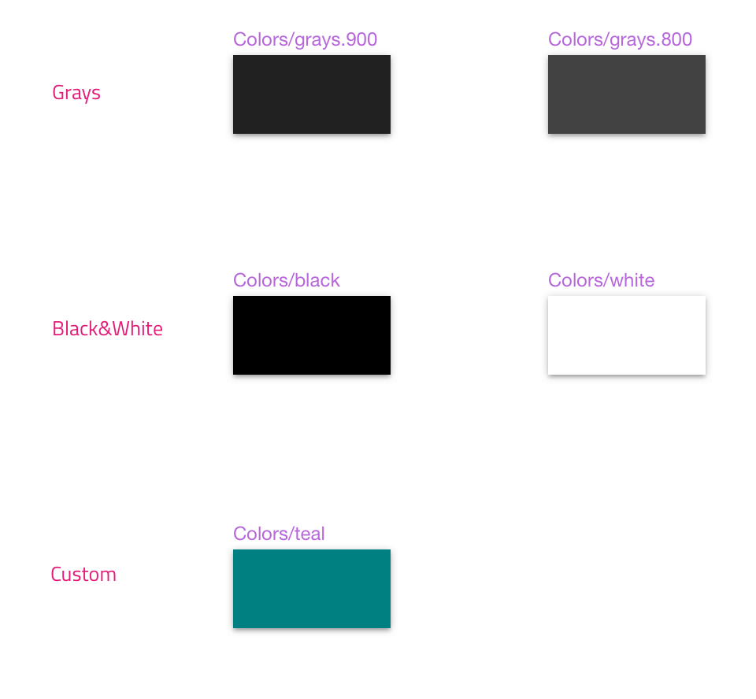

2.  In the color picker you will notice a `Create Color Variable` button which you need to select once you are happy with your choice.

    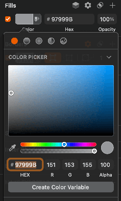

3.  Apply the same color variable to the border of the rectangle and name it accordingly e.g. `cool gray`.

    

4.  Now you have to create three color styles using the custom color rectange: one with just the fill, one with just the border, and one with both naming them accordingly.

    

5.  You are all set, your custom color will appear as a Color Variable and show up in the overrides for your Components and Patterns.

## Creating Custom Colors in Adobe XD

There are cases where we need more colors than the ones we have available. There are two approaches for creating custom colors that differ in terms of the scope we do this for.

If you want your added colors to be available across all the projects that use the library, navigate to the `Colors` artboard in it, and zoom to the empty `Custom` section underneath the `series` palettes.

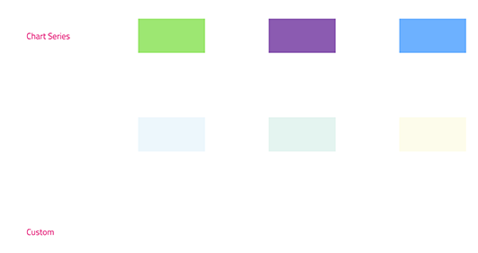

Then complete the steps below to finish the process. If you want your added colors to be accessible only within the scope of your current project, follow the steps below from anywhere in it.

1.  Draw a rectangle and set its fill to the color of your choice. 

    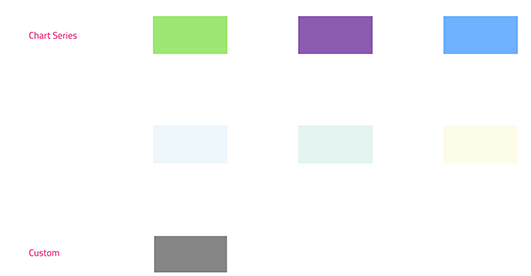

2.  Then, in the `Libraries` panel click on the `+` icon to the right of `Colors` to create the style and give it an appropriate name.

    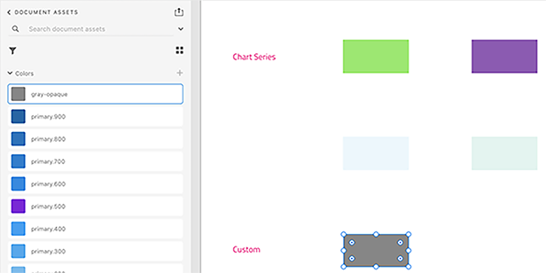

3.  You are all set, your custom color will appear as a `Color` in the `Libraries` panel and you can use it like any other color with your Components and Patterns.

## Additional Resources

Related topics:

- [Elevation](elevation.md)
- [Typography](typography.md)
  

Our community is active and always welcoming to new ideas.
