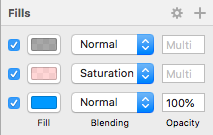
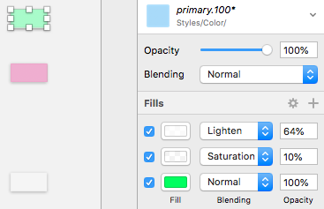

## Colors

Use Colors from the Styling library file to set up your theme's colors - `primary`, `secondary`, `success`, `warn`, `error`, `info`. The way Colors are set up in the Styling library is identical to the [Ignite UI for Angular Themes](https://www.infragistics.com/products/ignite-ui-angular/angular/components/themes.html).

### Palette Generation

To change the primary color, navigate to the `Colors` page in Indigo-Styling and while holding the `command` key select all the primary color variants. Then, find the Fills section in the right panel and click on the bottom one, which bears the main color component in order to change its value to another color. This will automatically update all primary variants to assure consistent look with Ignite UI for Angular.

> [!Warn]
> The two fills above are used for color variant generation and their values must always be kept as they are. Failing to comply with this guidance will result in inconsistencies and unpredictable code generation results.

Upon changing the bottom fill, you will see the whole primary palette instantly update. The same palette generation is available for the secondary color.

With the introduction of Library Styles in Sketch and our support for Shared Color Styles there is one more step that you need to do i.e. to update all respective color styles that have changed with the selection of a new primary/secondary color. In order to do that upon selecting an individual color element, you should be able to observe the following inconsistency.

To fix that click on the `primary.100*` style to drop the menu down and select the `Update Layer Style` option. This should be repeated for all remaining variants and for the secondary ones as well if they have been changed too.

> [!Note]
> Since the text colors are controlled by the `Typography`, to fully update the default theme, you also need to manually change the colors in the `Typography` page as well. Once you change your `primary` color, make sure you change the `Primary` section in Typography to the very same color. The exact steps to achieve this can be found in [Typography](typography.md).

### Adding More Colors

In the cases where one needs more colors, besides the ones in the palette, it is also possible to add custom colors and there are two approaches for doing so.

#### Global

If you want your added colors to be available across all the projects that use the libraries, follow these simple steps:

1.  Open the Styling library, navigate to the `Colors` page, and zoom to the empty `Custom` section underneath the `black`, `white`, and `transparent` row of color symbols.

    

2.  Select the `Colors/black` symbol and, while holding the `option` key drag the symbol below, create a copy of it.

    

3.  Now, select the `Rectangle` layer, which happens to be the only layer of the `Colors/black copy` symbol, and change its Fill to a color of your choice e.g. #008080 (teal). Remember to also rename the symbol accordingly e.g. `Colors/teal`.

    

4.  Save the changes to the library and now the color you have added should appear in the list of colors under `Indigo-Styling/Colors` in the `Insert` menu. It will also show up for the color overrides wherever colors are used in the Components and Patterns libraries.

#### Local

The second approach describes the addition of file-specific colors, not available across all projects, but only in the current one in which you are working. To achieve that, follow these simple steps:

1.  Open an existing or new Sketch file and create a new page, naming it `Local Styles`.

    

2.  Then, on the new page, insert a `Colors/black` element from the Styling library.

    

3.  Right click it and select `Detach from Symbol` to uncover this symbols-only contained layer called `Rectangle`. Select the `Rectangle` layer and change its Fill to a color of your choice e.g. #008080 (teal).

    

4.  Now, select the group that was formed after selecting `Detach from Symbol` (it should be called `Colors/black`, just like the symbol instance before) and click the `Create Symbol` button from the main Sketch menu at the top to reinstate the modified color as an overridable color symbol. In the prompt that will appear, choose a name for your custom color e.g. `Colors/teal` and make sure the Symbols Page checkbox is unselected before clicking the OK button. This will create the symbol and you should see something like this.

    

5.  Finally, let's do our housekeeping and remove the non-symbol rectangle with teal color, and we are all set. The color you have added should appear as a local symbol in the list of colors under the Document category. It will also show up for the color overrides under `Document/Colors` for all instances of Components and Patterns in the current project, where color is applicable.

    

## Code generation

A color style object when added to a Sketch drawing is rendered as an HTML div with the corresponding color and size.

Once you have set up your branding by adjusting the nuances of the `primary`, `secondary`, `success`, `warn`, `error`, and `info` color symbols, you probably want to achieve the same look for your generated code. Thanks to the robust theming in [Ignite UI for Angular](https://www.infragistics.com/products/ignite-ui-angular), this is possible with only a few lines of code. For a detailed walkthrough on how to create and add a color palette, check out the [Theming Topic](https://www.infragistics.com/products/ignite-ui-angular/angular/components/themes.html#generating-color-palettes). Just remember to insert the correct HEX values from Colors in the Styling Library.

## Additional Resources

Related topics:

- [Typography](typography.md)
  

Our community is active and always welcoming to new ideas.

