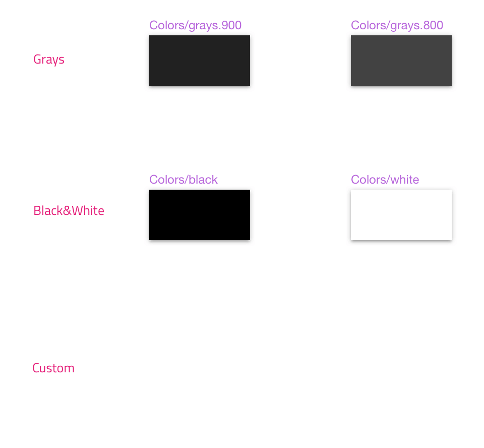

## Colors

Use Colors to set up your theme's colors - `primary`, `secondary`, `success`, `warn`, `error`, `info`. The way Colors are set up in the Styling library is identical to the [Ignite UI for Angular Themes](https://www.infragistics.com/products/ignite-ui-angular/angular/components/themes.html).

### Palette Generation

To change the primary color, navigate to the `Colors` page in the Sketch file and change the `Primary 500` symbol to a color of your choice. You will immediately see that the whole primary palette update instantly. The same palette generation is available for the secondary color.

> [!INFO]
> Since the text colors are controlled by the `Typography` to fully update the default theme, you also need to manually change the colors in the `Typography` page as well. Once you change your `primary` color, make sure you change the `Primary` section in Typography to the very same color. The exact steps to achieve this can be found in [Typography](typography.md).

### Adding More Colors

In the cases where one needs more colors, besides the ones in the palette, it is also possible to add custom colors and there are two approaches for doing so.

#### Global

If you want your added colors to be available across all the projects that use the libraries follow these simple steps:

1.  Open the Styling library, navigate to the `Colors` page and zoom to the empty `Custom` section underneath the `black`, `white` and `transparent` row of color symbols.
    

2.  Select the `Colors/black` symbol, and while holding the `option` key drag the symbol below, creating a copy of it.
    

3.  Now select the `Rectangle` layer, which happens to be the only layer of the `Colors/black copy` symbol, and change its Fill to a color of your choice e.g. #008080 (teal). Remember to also rename the symbol accordingly e.g. `Colors/teal`
    

4.  Save the changes to the library and now the color you have added should appear in the list of colors under the Styling library menu. It will also show up for the color overrides wherever colors are used in the Components and Patterns libraries.

#### Local

The second approach describes the addition of file-specific colors, not available across all projects, but only in the current one you are working. To achive that follow these simple steps:

1.  Open an existing or new Sketch file and create a new page, naming it `Local Styles`. Then on the new page insert a `Colors/black` element from the Styling library.
    

2.  Right click it and select `Detach from Symbol` to uncover this symbols only contained layer called `Rectangle`. Select the `Rectangle` layer and change its its Fill to a color of your choice e.g. #008080 (teal).
    

3.  Now select the group that was formed after selecting `Detach from Symbol` (it should be called `Colors/black`, just like the symbol instance before) and click the `Create Symbol` button from the main Sketch menu at the top to reinstantiate the modified color as an overridable color symbol. In the prompt that shall appear choose a name for your custom color e.g. `Colors/teal` and make sure the Symbols Page checkbox is unticked before clicking the OK button. This will create the symbol and you should see something like this.
    

4.  Finally, let's do our housekeeping and remove the non-symbol rectangle with teal color and we are all set. The color you have added should appear as a local symbol in the list of colors under the Document category. It will also show up for the color overrides under `Document/Colors` for all instances of Components and Patterns in the current project, where color is applicable.
    

## Additional Resources

Related topics:

- [Typography](typography.md)
  

Our community is active and always welcoming to new ideas.

- [Indigo Design **GitHub**](https://github.com/IgniteUI/design-system-docfx)
