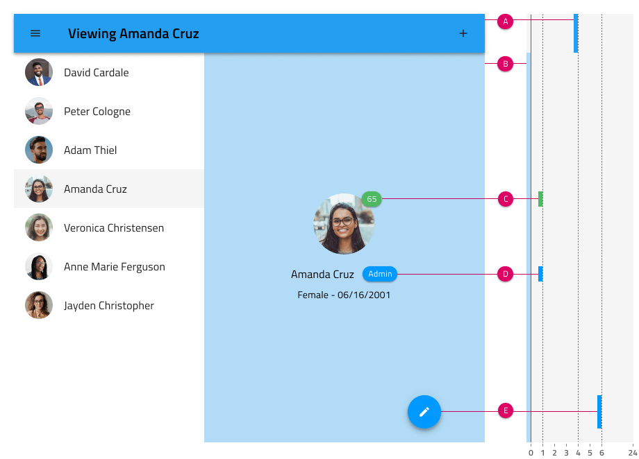

## Elevation

Elevations are used across Components and Patterns to establish shadows that are floating elements, such as a Floating Action Button, Card, or a Login Form. These should cast on the underlying content and background. The Elevations in Styling are identical to the [Material Design Elevation](https://material.io/design/environment/elevation.html#) & [Ignite UI for Angular Shadows](https://www.infragistics.com/products/ignite-ui-angular/angular/components/shadows.html).

### Support for elevations

There are 24 Elevations available in three distinct shapes:

- Circle - This works best for circular elements like a Floating Action Button.
- Rect - This is most suitable for a Dropdown or a Toggle Menu.
- Rounded Rect - This is for rectangular elements with corner rounding like a Card.

The higher the number of the Elevation, the more prominent the shadow. Shadows come as a combination of three stacked shadow colors, umbra, penumbra, and ambient, whose values match the Material Design definition.

> [!Note]
> Changing the Elevation in the Component overrides is possible in Sketch and will produce the expected outcome, but the same will not be achievable with Ignite UI for Angular yet.

### Use of standalone elevations

It is also possible to use Elevation on its own to lift one part of the content and draw more focus to it than the rest. In such scenarios, simply drag the Elevation of your choice and match it to the size of the content you would like to enhance.

## Additional Resources

Related topics:

- [Button](button.md)
- [Card](cards.md)
- [Forms](forms.md)
  

Our community is active and always welcoming to new ideas.

- [Indigo Design **GitHub**](https://github.com/IgniteUI/design-system-docfx)
