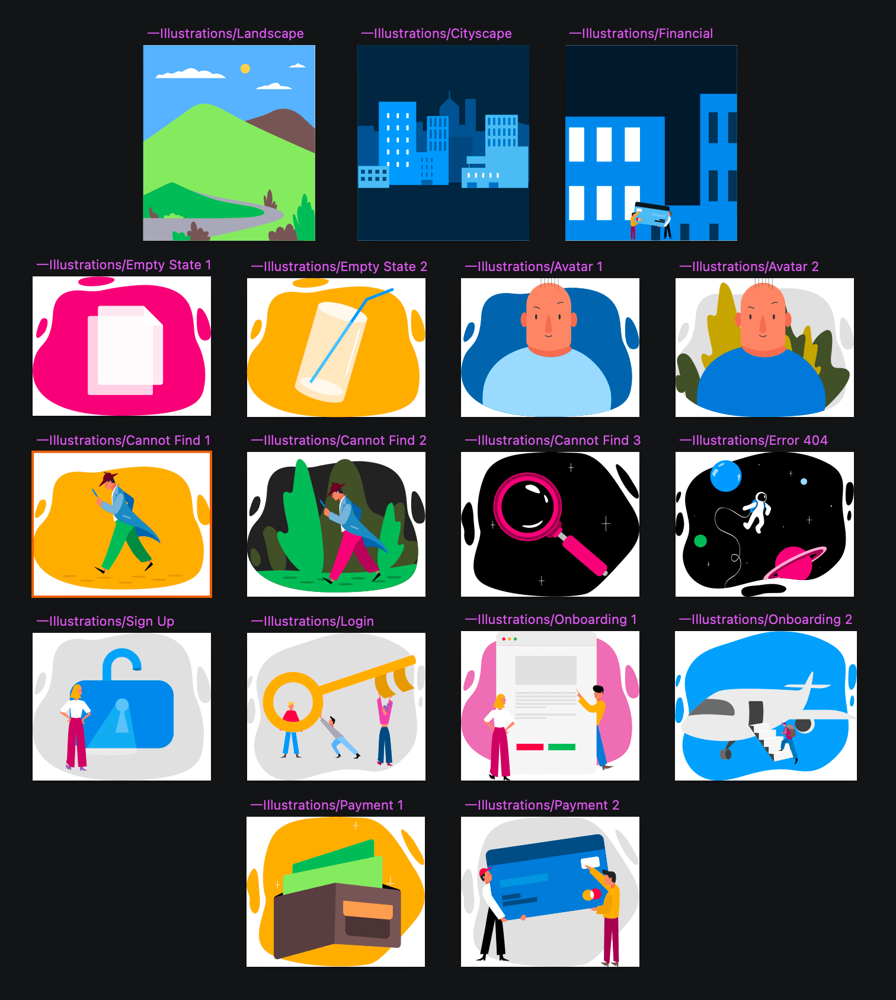

## Illustrations

Use Illustrations from the Styling library file to complement your interfaces with a drawing that provides more context into the components layout and makes it more pleasing and complete through the presence of a key visual element.

### Using Colors

Each illustration provides specific level of customization via applying another color to certain elements or hiding them by setting their color to transparent. Certain elements are purposefully not customizable, such as the skin color of a character, however, one can still change these globally by opening up the Styling Library and applying different colors in it.

## Code generation

> [!Warning]
> Illustration don't generate a code asset in the current version of Indigo.Design. This has been noted as a [known issue](../known-issues.md) and is something that will be implemented in the upcoming releases.

## Additional Resources

Related topics:

- [Colors](colors.md)
  

Our community is active and always welcoming to new ideas.
