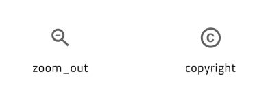

# Material Icons

The material icons that come with the **Indigo.Design System** contain 160+ icons imported from [Material resources](https://material.io/resources/icons/?style=baseline) and 360+ icons crafted by the **Indigo.Design System** team according to the [Material system icons guidelines](https://material.io/design/iconography/system-icons.html#design-principles). Icons are used to symbolize common actions in Icon Buttons, List Items, Cards, etc., to reduce the amount of text that is normally used in a label, for example. All icons are also supported in [Ignite UI for Angular](https://www.infragistics.com/products/ignite-ui-angular).

- In **Figma**, you can access all the icons on a dedicated page labeled `Icons`. The icons' appearance can be customized using predefined `Color styles`, enabling you to adjust their colors to suit your design needs.

> [!Note]
> There is also a dedicated [Icon](../components/icon.md) component with three sizes: Large, Medium and Small. Use it when creating intricate layouts for articles, custom Cards, List Items etc. You can then assign one of the glyphs available using the property `Type` in the property panel.

## Available Material Icons

There is a set of 160+ Material Icons already available in the **Indigo.Design System**, which are grouped in the following way according to the Material Design categorization:

- Action
- Alert
- AV
- Communication
- Content
- Device
- Editor
- File
- Hardware
- Image
- Maps
- Navigation
- Notification
- Places
- Social
- Toggle
- WB

There is also a set of 360+ additional Material Icons that our team has crafted as an extension to the original Material set for the following categories:

- Construction
- Content
- Editor
- Elections
- Finance
- Health
- Logos
- Programming
- Social Media

These icons are also available on [GitHub](https://github.com/IgniteUI/material-icons-extended) to use in your projects.

## Adding Icons

With the preset collection of icons, you can design beautiful apps and pick the right symbolic representations for your Components and Patterns. Adding further icon sets is possible, but so is extending the current one with further Material Icons. Since [Ignite UI for Angular](https://www.infragistics.com/products/ignite-ui-angular) supports any Material Icon out there, this could be exactly what you are looking for. Navigate your browser to the [Material Design Icons Tool](https://fonts.google.com/icons?selected=Material+Icons). Search for the icon you need, e.g. `copyright`, download it as an [SVG](https://fonts.google.com/icons?selected=Material+Icons&icon.query=copyright), and note the category to which it belongs. In this case, it would be `Action`. 

### In Figma

1.  Open up the library in Figma, navigate to the `Icons` page and look if that same category exists as a frame in the layers panel, in the left sidebar. If it does not, create it and follow the steps below. If it does, which is our case for the `copyright` icon from the `Action` category, just find the right-most icon from that category, and you should be looking at something like this. Please consider that the icons are alphabetically ordered in every category.

    

2.  Now, duplicate the Component for this right-most icon and move it right a bit. Its name should be the same as the duplicated one and its layers structure should look like this:

    | Layer                                                                             | Use                                                                              |
    | --------------------------------------------------------------------------------- | -------------------------------------------------------------------------------- |
    | Icon name  | Defines the icon name as a component |
    | Color      | Nested icon shape within the component which is the graphic visualisation of the icon |
    | Text layer | Displays the icon name as an additional text layer in the frame. |

    

3.  Next, we want to replace the existing icon shape with the SVG we have downloaded, so we need to select the Icon name layer and drag and drop the SVG with the `copyright` icon in the workspace. This will place the SVG over the icon component and will help you to find it easier. After dropping the SVG, this will create a new frame, `copyright_black_24dp`, in our layers panel, which we need to expand and drag the desired icon shape just outside of any other groups, but still in its current frame. After that, remove any other additional groups - leave just the icon shape in the frame.

    

4.  Then, we have to select the frame `copyright_black_24dp` with the `Vector` shape within and create a component from the frame. There are two quick options to do that: right-click on the frame and select the `Create component` option or click on the `Create component` icon , positioned in the right property panel. Next, change the vector shape name to `Color` and set its color to `grays.700` from the `Selection colors` in the right sidebar.

    
    

5.  After updating the Icon component name accordingly, you need to swap it with the component in the duplicated one.

    

6. Last, you'll need to publish the change as an update to your library. To see these changes in subscribed files, you must review and accept the changes.

## Additional Resources

Related topic:

- [Colors](colors.md)
- [Icon](../components/icon.md)

Our community is active and always welcoming to new ideas.
