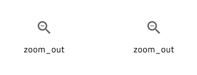

# Material Icons

The material icons that come with the **Indigo.Design System** contain 160+ icons imported from [Material resources](https://material.io/resources/icons/?style=baseline) and 360+ icons crafted by the **Indigo.Design System** team according to the [Material system icons guidelines](https://material.io/design/iconography/system-icons.html#design-principles). Icons are used to symbolize common actions in Icon Buttons, List Items, Cards, etc., to reduce the amount of text that is normally used in a label, for example. All icons are also supported in [Ignite UI for Angular](https://www.infragistics.com/products/ignite-ui-angular).

In Sketch, these graphics are on a separate page named `🎨 Material Icons`, and their colors are defined via the `Layer Styles`, letting you customize the appearance of an icon in the designs that you are crafting. In Adobe XD they are placed on an Artboard with the same name at the bottom of the left column of the library file, and customization can be achieved with the `Colors` from the Libraries panel on the left.

> [!Note]
> There is also a dedicated [Icon](../components/icon.md) component with four sizes: ExtraLarge, Large, Medium and Small. Use it when creating intricate layouts for articles, custom Cards and List Items etc. assigning one of the glyphs available under `🎨 Material Icons` rather than inserting it directly on your artboard.

## Available Material Icons

There is a set of 160+ Material Icons already available in the **Indigo.Design System**, which is grouped in the following way according to the Material Design categorization:

- file
- communication
- action
- alert
- av
- content
- device
- image
- maps
- navigation
- notifications
- social
- toggle
- editor
- wb
- hardware

There is also a set of 360+ additional Material Icons that our team has crafted as an extention to the original Material set for the following categories:

- finance
- health
- logos
- programming
- social media
- content
- editor
- elections
- construction

These icons are also available on [GitHub](https://github.com/IgniteUI/material-icons-extended) to use in your projects.

## Adding Icons

With the preset collection of icons, you can design beautiful apps and pick the right symbolic representations for your Components and Patterns. Adding further icon sets is possible, but so is extending the current one with further Material Icons. Since [Ignite UI for Angular](https://www.infragistics.com/products/ignite-ui-angular) supports any Material Icon out there, this could be exactly what you are looking for. Navigate your browser to the [Material Design Icons Tool](https://fonts.google.com/icons?selected=Material+Icons). Search for the icon you need, e.g. `copyright`, download it as an [SVG](https://fonts.google.com/icons?selected=Material+Icons&icon.query=copyright), and note the category to which it belongs. In this case, it would be `Action`. 

### In Sketch

1.  Open up the library in Sketch, navigate to the `🎨 Material Icons` page and look if that same category exists as a text layer on the left. If it does not, create it and follow the steps below. If it does, which is our case for the `copyright` icon from the `Action` category, just find the right-most icon from that category, and you should be looking at something like this.

    

2.  Now, duplicate the Symbol for this right-most icon and move it right a bit. Its name should end with `...Copy` and its layers structure should look like this:
    | Layer | Use |
    | ----------------------- | ----------------------------------------------------- |
    | Color | Defines the icon shape and color |
    | Shape | Always a rectangle that defines the icon bounding box |
    

    

3.  Next, we want to replace the existing icon shape with the SVG we have downloaded, so we need to select the Color layer and drag and drop the SVG with the `copyright` icon on top of it. This will create a new group `copyright-24px` in our layers panel, which we need to expand and drag the desired icon shape just outside of this group, but above the rectangular Shape layer.

    

4.  Let's remove the old icon glyph now and the leftover group after moving the new icon shape out of it. Then, we have to select the one and only icon shape we have left with the `copyright` symbol change its name to `Color` and set its appearance to `grays.700` fill-only style. 

   

5.  After updating the Symbol name accordingly, we are all set to use this icon just like any other one.

    

### In Adobe XD

1.  Open up the library in Adobe XD, navigate to the `🎨 Material Icons` artboard, and look if that same category exists as a text layer on the left. If it does not, create it and follow the steps below. If it does, which is our case for the `copyright` icon from the `Action` category, just find the right-most icon from that category, and you should be looking at something like this.

    

2.  Now, duplicate the Symbol for this right-most icon and move it right a bit. This will create an instance of the symbol indicated by the white diamond shape with a green outline in the top-left corner when the instance is selected.

    

3.  Ungroup this instance and create a new group from the two new layers, naming it "_Overrides/Material Icons/action/copyright".
    | Layer | Use |
    | ----------------------- | ----------------------------------------------------- |
    | Group ~ | Defines the icon shape and color |
    | Shape | Always a square that defines the icon bounding box |
    

    

4.  Next, we want to replace the existing icon shape with the SVG we have downloaded, so we need to select the Group with the old glyph and drag and drop the SVG with the `copyright` icon on top of it aligning the two on all sides. This will create a new group `copyright-24px` in our layers panel, which we need to expand and drag the desired icon shape just outside of this group, but above the rectangular Shape layer.

    

5.  Let's remove the old icon glyph now and the leftover group after moving the new icon shape out of it. Then, we have to select the one and only icon shape we have left with the `copyright` symbol and set its appearance to `grays.700` from Colors in the Libraries panel. 

   

6.  The final step is to create a component from the _Overrides/Material Icons/action/copyright group to be able to start using it like any other icon element in our design.

    

## Additional Resources

Related topic:

- [Colors](colors.md)
- [Icon](../components/icon.md)
  

Our community is active and always welcoming to new ideas.
