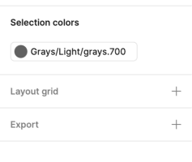

## Material Icons

Use the Material Icons to symbolize common actions in Icon Buttons, List Items, Cards etc. to reduce the amount of text that is normally used as a Button label for example. Material Icons consume the Colors Symbols in Styling, which lets you pick any of the defined colors for an Icon in the designs that you are crafting. The set of icons added to the Styling library is a subset of elements, identical to the [Material Icons](https://material.io/tools/icons/?style=baseline) and supported within [Ignite UI for Angular](https://www.infragistics.com/products/ignite-ui-angular).

> [!Note]
> The Components library provides dedicated [Icon](icon.md) symbol for four icon sizes: ExtraLarge, Large, Medium and Small. Use these when creating intricate layouts for articles, custom Cards and List Items etc. rather than the Styling library directly.

### Available Material Icons

There is a set of 100+ Material Icons already available in the Styling library and grouped in the following way according to the Material Design categorization:

- file
- communication
- action
- alert
- av
- content
- device
- image
- maps
- navigation
- notifications
- social
- toggle
- editor
- wb
- hardware

### Adding Material Icons

With the preset collection of icons, you can design beautiful apps and pick the right symbolic representations for your Components and Patterns. Adding further icon sets is possible, but so is extending the current one with further Material Icons. Since [Ignite UI for Angular](https://www.infragistics.com/products/ignite-ui-angular) supports any Material Icon out there, this can be exactly what you are looking for. To do so, follow these simple steps:

1.  First, navigate your browser to the [Material Design Icons Tool](https://material.io/tools/icons). Search for the icon you need, e.g. `copyright`, download it as an SVG, and note the category to which it belongs. In this case, would be `Action`. Now, open up the Styling library in Sketch and look if that same category exists as a text layer on the left. If it does not, create it and follow the steps below. If it does, which is our case for the `copyright` icon from the `Action` category, just find the right-most icon from that category and you should be looking at something like this.
    

2.  Now, duplicate the Symbol for this right-most icon and move it right a bit. Its name should end with `...Copy` and its structure should look like this within the overarching group named similarly to the Symbol.
    | Layer | Use |
    | ----------------------- | ----------------------------------------------------- |
    | Icon 24px | Groups together the icon elements |
    | &nbsp;&nbsp; ↳ 🌈 Color | Defines the icon color |
    | &nbsp;&nbsp; Shape | Defines the icon shape |
    | &nbsp;&nbsp; Shape | Always a rectangle that defines the icon bounding box |
    

3.  Next, we want to replace the existing icon shape with the SVG we have downloaded, so we need to select the Shape layer with the icon shape and then drag and drop the SVG with the `copyright` icon on top of it. This will create a new group with the icon name in our layers panel, which we need to expand and drag the desired icon shape just outside of this group, but above the original icon shape.
    

4.  Let's remove the original icon shape now and the leftover group after moving the new icon shape out of it. Then, we have to select the one and only icon shape we have left with the `copyright` symbol and make sure it has neither borde, nor fill and is just used as a mask. After renaming the overarching group and the Symbol itself accordingly, e.g. to `copyright` and `Icons/action/copyright`, we are all set to use this icon just like any other one.
    

## Additional Resources

Related topics:

- The [Icon](../components/icon.md) Component
  

Our community is active and always welcoming to new ideas.

- [Indigo Design **GitHub**](https://github.com/IgniteUI/design-system-docfx)
