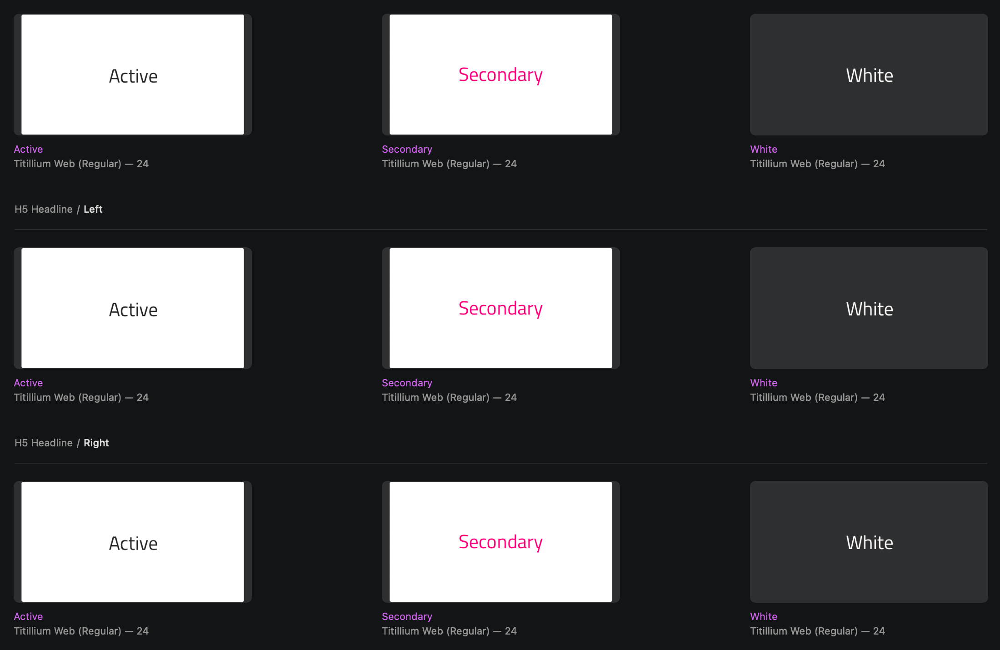
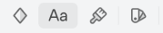
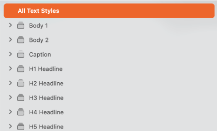
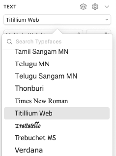
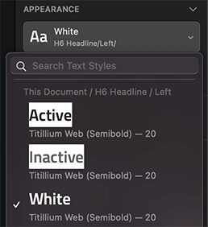
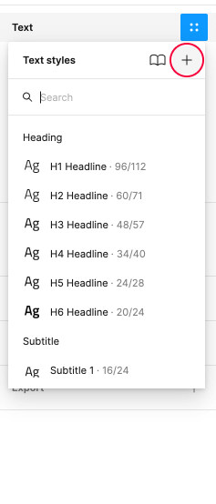
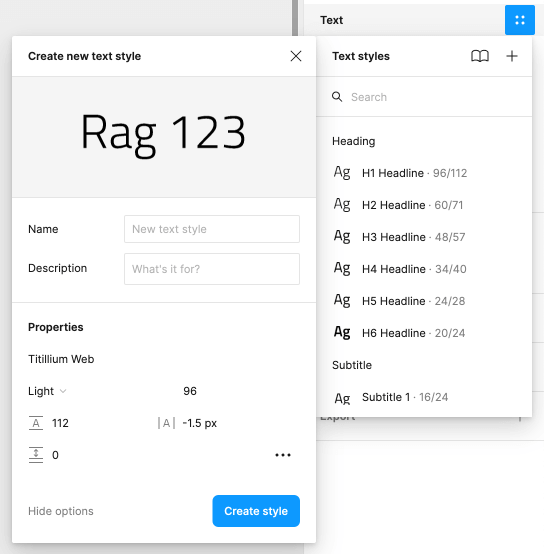

# Typography

On the `🎨 Typography` page of the **Indigo.Design System** you will find a collection of type scales that will let you set up your theme's typeface. Although we are using [Titillium Web](https://fonts.google.com/specimen/Titillium+Web) as a default, we really want to give every designer the flexibility to craft his applications with style. Indigo.Design Typography follows the definitions set by the [Material Type System](https://material.io/design/typography/the-type-system.html#type-scale) and the implementation of the [Ignite UI for Angular Typography](https://www.infragistics.com/products/ignite-ui-angular/angular/components/themes/typography).

To use the Typography in your project all you need to do is apply one of the Text Styles defined in the library to any text layer. There is a vast selection of type presets with different sizes, colors and alignments incuding:

- 6 Headlines from `H1` to `H6` for titles.
- 2 `Subtitle` sizes.
- 2 `Body` sizes for the paragraph content in you interface.
- A `Caption` and an `Overline` style that can be used for complimentary content.

Use these when creating intricate layouts for articles, blog posts etc. The Text Styles in the **Indigo.Design System** are meant to help you define a consistent theme and style for all the texts in your designs.

> [!Warning]
> There is also a collection of `Internal` styles used within the Components for validation, special cases such as the label of a Button, and data-dense scenarios like the Grid. These styles are not supposed to be inserted in your interface directly but exist to assure typographic consistency for the Components within which they are used.

## Typography Colors

Typography comes in multiple preset colors, such as `active` corresponding to `grays.900`, `inactive` corresponding to `grays.700`, `disabled` corresponding to `grays.500`, `white` and `secondary`. There are also type scales with special colors for strings that need to be in `success`, `warn`, and `error` colors, as well as some additional nuances used by the Indigo.Design Components.

## Component Specific Typography

Components, such as [Avatar](../components/avatar.md), [Button](../components/button.md), [Grid](../components/grid.md), [Slider](../components/slider.md) and [Tooltip](../components/tooltip.md) use component-specific Typography to accommodate the specifics of the styling used by the respective component e.g. the Avatar needs a larger variety of colors and the Button uses an all caps style.

## Changing the Typeface

To change typeface from Titillium Web to another one in Sketch open the Indigo.Design library file and select `View` -> `Components`. Then in the Sketch menu you will notice a group of four buttons, where the second one is a character icon and stands for `Show Text Styles`.

After selecting it you will be able to browse all text styles that the **Indigo.Design System** defines. In the panel on the left make sure you have `All Text Styles` chosen and select all styles appearing in the middle area of Sketch by clicking on one of them and pressing `command` + `A`.

Now, in the panel on the right there is a dropdown allowing you to choose another typeface for all the `Text Styles`. With that you are all set, the changes will not only update all `Text Styles`, but also propagate to all Components and Patterns automatically.

The `Text Styles` in Sketch use color variables to define the color property of the text. Thus, if you were to change the `primary` color as per the steps outlined in the [colors topic](colors.md), all your primary `Text Styles` will be automatically updated. 

## Creating Custom Typographies

The variety of type scales and `Text Styles` should be more than sufficient to design various user interfaces. However, you may occasionally need to create an extra style for specially colored heading, for example. If you want to define it globally for all your projects simply create a duplicate from an existing heading, choose the appropriate color for it and name it accordingly. If it is something meaningful only within the scope of your current project start by inserting a new `Text` layer in Sketch. Then assign to it the closest `Text Style` from the existing ones fed from the library via the `Appearance` panel.

Next, make the adjustments like changing the text color to a different color variables, for example.

Last, click the Create button and give the new style an appropriate name and you are all set.

## Additional Resources

Related topics:

- [Colors](colors.md)
- [Avatar](../components/avatar.md)
- [Button](../components/button.md)
- [Grid](../components/grid.md)
- [Slider](../components/slider.md)
- [Tooltip](../components/tooltip.md)
  

Our community is active and always welcoming to new ideas.
