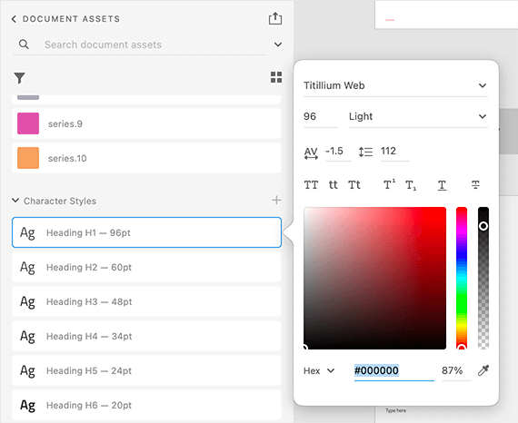
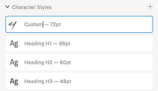

# Typography

There are 12 text (character) styles in the **Indigo.Design System** that constitute its typography and let you set up your theme's typeface. Although we are using [Titillium Web](https://fonts.google.com/specimen/Titillium+Web) as a default, we really want to give every designer the flexibility to craft his applications with style. Indigo.Design follows the way typography is defined in the [Material Type System](https://material.io/design/typography/the-type-system.html#type-scale) and complies with the implementation of the [Ignite UI for Angular Typography](https://www.infragistics.com/products/ignite-ui-angular/angular/components/themes/typography).

In Sketch, these can be found on a separate page named `🎨 Typography` and are available as `Text Styles` that can be applied to any text element. In Adobe XD they are placed on an Artboard with the same name in the left column of the library file and exist as `Character Styles` that are used across components and patterns.

## Typography Styles

To use the typography system in your project, all you need to do is apply one of the text (character) styles defined in the library to a native text element. Sketch offers a vast selection of type presets with different sizes, colors, and alignments, while Adobe XD defines only the size and lets you adjust the alignment and apply a color style.

- 6 Headlines from `H1` to `H6` for titles.
- 2 `Subtitle` sizes.
- 2 `Body` sizes for the paragraph content in you interface.
- A `Caption` and an `Overline` style that can be used for complimentary content.
- A `BUTTON` style that is used exclusively in the Button components

These styles also determine the type of text element and typography class that will be generated for the related layer in the application. The following elements will be generated based on the Typography Text Style applied to a generic text layer:
- Headlines `<h1>` to `<h6>` for the headlines typography styles.
- Paragraph `
` with typography class:
  - `igx-typography__subtitle-1`/ `igx-typography__subtitle-2` for the two subtitle typography styles.
  - `igx-typography__body-1`/`igx-typography__body-2` for the two body typography styles.
  - `igx-typography__caption` for the caption typography style.
  - `igx-typography__overline` for the overline typography style.

These styles can be modified further via the Sketch plugin to change the look of those elements via theming on the application level.

Use these when creating intricate layouts for articles, blog posts etc. The Text Styles in the **Indigo.Design System** are meant to help you define a consistent theme and style for all the texts in your designs.

> [!Warning]
> In Sketch, there is also a collection of `Internal` text styles used within the Components for validation and special cases. These styles are not supposed to be inserted on your artboards directly but exist to assure typographic consistency for the Components within which they are used.

## Component Specific Typography

Components, such as [Avatar](../components/avatar.md), [Button](../components/button.md), [Grid](../components/grid.md), [Slider](../components/slider.md) and [Tooltip](../components/tooltip.md) use component-specific Typography to accommodate the specifics of the styling used by the respective component e.g. the Avatar with initials and Button use an all caps style. Below you can find the text styles defined for the Avatar in Sketch to allow more versatile usage of font colors.

## Typography Color Variants in Sketch

In Sketch, the text styles include the text color, thus each one comes in multiple preset colors, such as `active` corresponding to `grays.900`, `inactive` corresponding to `grays.700`, `disabled` corresponding to `grays.500`, `white` and `secondary`. There are also scales with special colors for strings that need to be in `success`, `warn`, and `error` colors, as well as some additional nuances used by the Indigo.Design Components.

## Changing the Typeface in Sketch

To change the typeface from Titillium Web to another one in Sketch, open the Indigo.Design library file and select `View` -> `Components`. Then in the Sketch menu, you will notice a group of four buttons, where the second one is a character icon and stands for `Show Text Styles`.

After selecting it you will be able to browse all text styles that the **Indigo.Design System** defines. In the panel on the left make sure you have `All Text Styles` chosen and select all styles appearing in the middle area of Sketch by clicking on one of them and pressing `command` + `A`.

Now, in the panel on the right there is a dropdown allowing you to choose another typeface for all the `Text Styles`. With that you are all set, the changes will not only update all `Text Styles`, but also propagate to all Components and Patterns automatically.

The `Text Styles` in Sketch use color variables to define the color property of the text. Thus, if you were to change the `primary` color as per the steps outlined in the [colors topic](colors.md), all your primary `Text Styles` will be automatically updated. 

## Changing the Typeface in Adobe XD

To change the typeface from Titillium Web to another one in Adobe XD open the Indigo.Design library file and select the `Libraries` panel. Then scroll to `Character Styles` right-click on one of them, and from the contextual menu that appears, choose `Edit`. In the popover, there is a dropdown at the top, allowing you to choose another font family. Note that you have to perform the same steps for every style individually to amend this change for all of your typography.

## Creating Custom Typographies

The typographic variety of styles should be more than sufficient to let you design various user interfaces. However, you may occasionally need to create an extra style for a special use case. If you want to define it globally for all your projects, do it in the Indigo.Design library. If it is something meaningful only within the scope of your current project, do it in the project file instead.

### In Sketch
Start by inserting a new `Text` layer and assign to it the closest `Text Style` from the existing ones fed from the library via the `Appearance` panel.

Next, make the adjustments like changing the text color to a different color variables, for example.

Last, click the Create button and give the new style an appropriate name and you are all set.

### In Adobe XD
Start by inserting a new `Text` layer and adjust its properties on the right panel under `Text`. For example, choose a different font, size, alignment, and set an all lower case style.

Then, in the `Libraries` panel, click on the `+` icon to the right of `Character Styles` to create the style and give it an appropriate name.

## Additional Resources

Related topics:

- [Colors](colors.md)
- [Avatar](../components/avatar.md)
- [Button](../components/button.md)
- [Grid](../components/grid.md)
- [Slider](../components/slider.md)
- [Tooltip](../components/tooltip.md)
  

Our community is active and always welcoming to new ideas.
