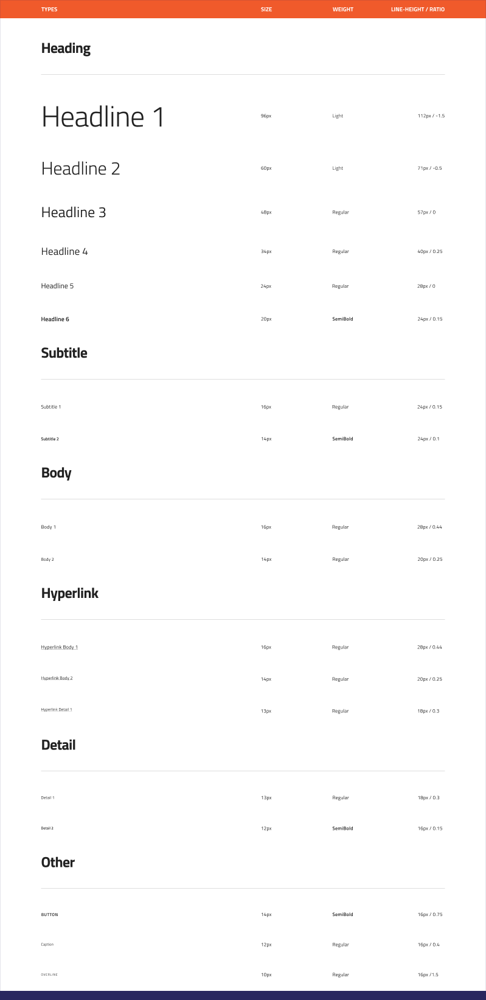
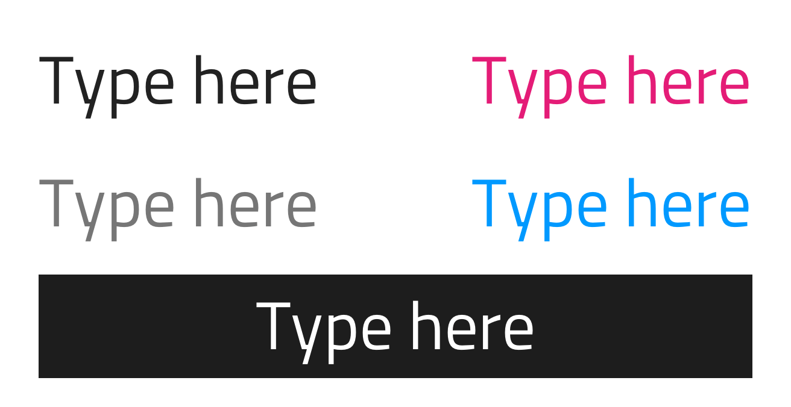
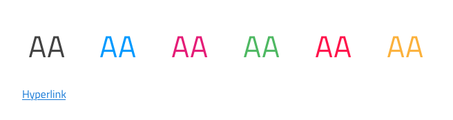
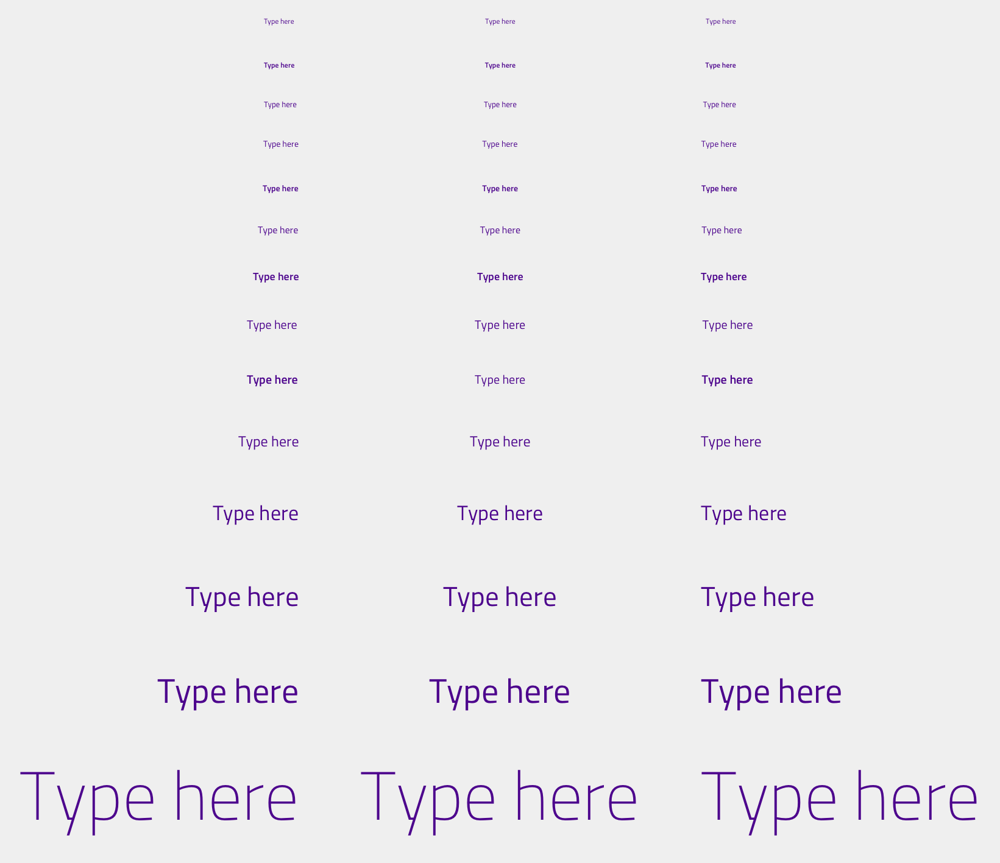

## Typography

Use Typography to set up your theme's typeface and available sizes. Although we are using [Titillium Web](https://fonts.google.com/specimen/Titillium+Web) as the default typeface, we really want to give every designer the flexibility to craft his applications with style. The essence of Typography in the Styling library is resonating with the way typography is implemented in the [Material Type System](https://material.io/design/typography/the-type-system.html#type-scale) and in the [Ignite UI for Angular Typography](https://www.infragistics.com/products/ignite-ui-angular/angular/components/themes/typography.html).



With the introduction of Library Styles in Sketch and our support for Shared Typography Styles, there is a vast selection of type presets. Headline, subtitle, body, caption and overline tyles can be applied to a native Sketch `Text` element, or dragged to an arboard from the `Text Styles` section of the `Insert` menu. Use these when creating intricate layouts for articles, blog posts etc.

> [!Warn]
> There is also a collection of `Internal` styles used within Components for validation scenarios, special components such as the Button and Hyperlink and data-dense scenarios like the Grid. These styles are not supposed to be inserted in your interface directly, but exist to assure typograpic consistency for the Components within which they are used.

Typography in Indigo-Styling, is meant to help you define a consistent theme and style for all the texts in your designs.

### Typography colors

Typography comes in multiple preset colors such as: `primary`, `secondary`, `active` corresponding to `grays.900`, `inactive` corresponding to `grays.700`, `disabled` corresponding to `grays.500` and `white`. There is also one additional set of specialty colors, containing Typography variations for strings that need to be in `success`, `warn`, and `error` colors, as well as a some additional nuances used by the Components in the following section.



### Component specific typography

Components, such as [Avatar](../components/avatar.md) and [Hyperlink](../components/hyperlink.md) use component-specific Typography to accommodate the specifics of the styling used by the respective component e.g. the Avatar needs a larger variety of colors, while the Hyperlink comes with an underlined text.



### Changing the typeface

In order to change the typeface, hold the `command` key and drag across the whole Typography secton. This will select the individual text layers (otherwise you'll select the symbols). Now change the typeface to the one of your choice and you are all set.


### Changing colors of typography

Once you update the `primary` and `secondary` colors as the first step for theming your applications, you will see that the text colors for typography will not update automatically. In order to update the text colors as well, hold the `command` key and drag across the whole `primary` or `secondary` section. This will select the individual text layers (otherwise you'll select the symbols). Now, change the text color to your color of choice and there is only one more step before your theme is up to speed, updating all Text Styles that have been affected through the change of color or typeface-related properties. To do so, select each text layer click on its style to drop the menu down and select the `Update Layer Style` option like you did for the colors. This should be repeated for all remaining text elements that have been changed.



## Code Generation

A typography style object when added to a Sketch drawing is rendered as an HTML div with the corresponding text, color and size.

### Data bindings

Data bindings are specified by using curly brace syntax, example: {isAdmin}.Data bindings can be non-nested or nested. If the target property is a nested property, include the nested property chain, but don’t include the model object name. Examples:

#### Not Nested

```typescript
Customer {
  imageName: String;
}
```

DataProperty would be: `{imageName}`

#### Nested

```typescript
Profile {
  imageName: String;
}

Customer {
  profile: Profile;
}
```

DataProperty would be: `{profile.imageName}`

### Text

The Text property may contain text, binding, or a combination of the two, examples:

- Settings
- {settingsLabel}
- Important {labelText}

## Additional Resources

Related topics:

- [Avatar](../components/avatar.md)
- [Grid](../components/grid.md)
- [Hyperlink](../components/hyperlink.md)
  <div class="divider--half"></div>

Our community is active and always welcoming to new ideas.


