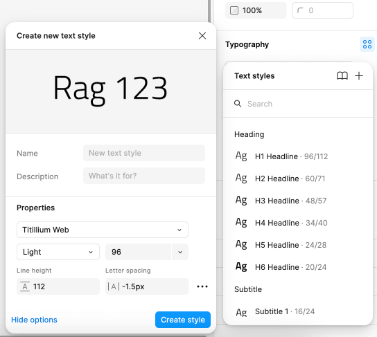

# Typography

There are 18 text (character) styles in the **Indigo.Design System** that constitute its typography and let you set up your theme's typeface. Although we are using [Titillium Web](https://fonts.google.com/specimen/Titillium+Web) as a default, we really want to give every designer the flexibility to craft his applications with style. Indigo.Design follows the way typography is defined in the [Material Type System](https://material.io/design/typography/the-type-system.html#type-scale) and complies with the implementation of the [Ignite UI for Angular Typography](https://www.infragistics.com/products/ignite-ui-angular/angular/components/themes/typography).

- In **Figma**, all text styles can be found on a separate page named `↳ Typography` which is part of the **Indigo.Design Sytem** `🧱 Foundation` section. They are available as `Text Styles` that can be applied to any text element.

## Typography Styles

To use the typography system in your project, all you need to do is apply one of the text (character) styles defined in the library to a native text element. Figma defines the Size, Weight, Line height, and Ratio (Letter spacing) and lets you adjust the alignment and apply a color style.

- 6 Headlines from `H1` to `H6` for titles.
- 2 `Subtitle` sizes.
- 2 `Body` sizes for the paragraph content in you interface.
- 3 `Hyperlink` sizes corresponding to the Body sizes and the Detail 1 size, for easy use of the Hyperlink in texts.
- 2 `Detail` sizes that are used exclusively in the Grid components.
- A `Caption` and an `Overline` style that can be used for complimentary content.
- A `BUTTON` style that is used exclusively in the Button components.

These styles also determine the type of text element and typography class that will be generated for the related layer in the application. The following elements will be generated based on the Typography Text Style applied to a generic text layer:
- Headlines `<h1>` to `<h6>` for the headlines typography styles.
- Paragraph `
` with typography class:
  - `igx-typography__subtitle-1`/ `igx-typography__subtitle-2` for the two subtitle typography styles.
  - `igx-typography__body-1`/`igx-typography__body-2` for the two body typography styles.
  - `ig-typography__body-1 hyperlink`/`ig-typography__body-2 hyperlink` for the two of the hyperlink typography styles.
  - `igx-typography__caption` for the caption typography style.
  - `igx-typography__overline` for the overline typography style.

Use these when creating intricate layouts for articles, blog posts etc. The Text Styles in the **Indigo.Design System** are meant to help you define a consistent theme and style for all the texts in your designs.

## Component Specific Typography

Components, such as [Avatar](../components/avatar.md), [Button](../components/button.md), [Grid](../components/grid.md), [Slider](../components/slider.md) and [Tooltip](../components/tooltip.md) use component-specific Typography to accommodate the specifics of the styling used by the respective component e.g. the Avatar with initials and Button use an all caps style.

## Typography & Color 

- In **Figma** the text styles do not include the text color, and you can adjust it based on the design needs.

## Changing the Typeface

### In Figma

If your styles are published to a team library, you need to edit the style in the library file. You'll need editing permissions for the library file to make any changes. To change the typeface from Titillium Web to a different one, you should access the **Indigo.Design System** library file. By default, styles in Figma are visible in the properties panel, if you haven't made any selections. Alternatively, you can navigate to the `↳ Typography` page for a more comprehensive view of all typography styles and make your changes from there. The text styles will continue to appear in the properties panel, located on the right side of the canvas.

Clicking on the Edit style icon will open a popover. In the properties section you'll see a dropdown, which allows you to choose another font family. Note that you have to perform the same steps for every style individually to amend this change for all of your typography.

After that, you'll need to publish these changes as an update to your library. To see these changes in subscribed files, you must review and accept the changes.

## Creating Custom Typographies

The typographic variety of styles should be more than sufficient to let you design various user interfaces. However, you may occasionally need to create an extra style for a special use case. If you want to define it globally for all your projects, do it in the Indigo.Design library. If it is something meaningful only within the scope of your current project, do it in the project file instead.

### In Figma

Create a new type layer with the Text tool (T) and make all the adjustments you need, then click on the Style icon in the Typography properties. Typography properties can be found in the right sidebar.

When you're done with all the adjustments to the layer, click on the Style icon and then select the Create style icon (+). This will open a popover, where you can give the new text style a name and description. You can also apply additional changes to the style, if needed.

Then, click the Create style button. That will list your new Text style in the Text styles in the right sidebar. Last, you can adjust the Text style position and align it to a specific section if needed or create a new one.

## Additional Resources

Related topics:

- [Colors](colors.md)
- [Avatar](../components/avatar.md)
- [Button](../components/button.md)
- [Grid](../components/grid.md)
- [Slider](../components/slider.md)
- [Tooltip](../components/tooltip.md)

Our community is active and always welcoming to new ideas.
