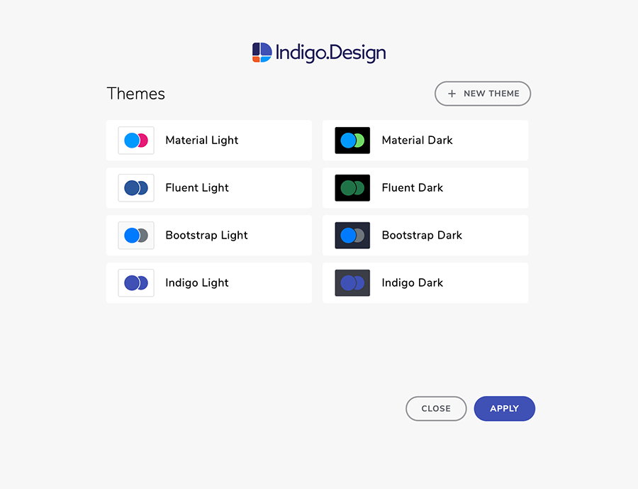
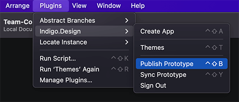

# Indigo.Design Plugin

The Indigo.Design Sketch Plugin allows to create and edit themes over your designs, and quickly create and publish apps and prototypes in Indigo.Cloud from these designs.

Once a design in Sketch is created with the Indigo.Design System, use the plugin to:

-  quickly create an app in Indigo.Design AppBuilder. This app follows the structure of the Sketch design, mapping any symbol from the Indigo.Design UI kit to the corresponding component from Ignite UI. The plugin also takes the images used in Sketch and uploads them in the Assets library under AppBuilder, benefiting from [`Assets` support](https://www.infragistics.com/community/blogs/b/jason_beres/posts/indigo-design-app-builder-october-release-with-assets-support).  

- create new themes and edit existing ones when using the Indigo.Design UI Kit for Sketch. Users can adjust the `primary`, `secondary`, `error`, `success`, `warn`, and `info` colors, as well as properties of the Typography according to their brand characteristics. The themes you have created will be there in the Indigo.Design AppBuilder, if you go and create an app from your design!

- effortlessly publish prototypes to the Indigo.Design Cloud and sync them up regularly thereafter, when making changes and updates.

## 1. Installing the Indigo.Design plugin

The Indigo.Design Plugin is available after signing in to the [Indigo.Design Cloud](https://cloud.indigo.design). Go to the `Getting Started` menu and click the `GET INDIGO.DESIGN SYSTEM` button to open the assets dialog. Under the Sketch tab you may download the plugin archive, open it, double click on the Sketch plugin file and the Indigo.Design plugin will be installed. Under the Adobe XD tab you will be able to land on the Adobe Exchange page of Indigo.Design from where you can easily get the plugin. 

## 2. Create an application in AppBuilder
Take your designs and create interactive, responsive apps with real UI components and styling. Use the `Create New App` feature of the plugin to transform your Sketch and Adobe XD designs into a real applications under the AppBuilder, allowing access to the images and themes - all of this directly in the cloud.

The plugin allows you to choose a name and resolution for your app, as well as to select the Indigo.Design Cloud workspace, where the app will be created.

In Adobe XD app creation is the only feature available in the plugin for now.

## 3. Themes

This section provides guidance and shows some best practices regarding the creation and application of themes in Sketch projects created with the Indigo.Design UI Kit. By sticking to the recommendations below you will be able to apply your brand assets, such as typography and colors, to your project and libraries. The result of this small effort is that all UI Components will consistently represent your brand in one or more projects.

### Launching theme configuration

Navigate to the `Plugins` menu in Sketch and under `Indigo.Design` select `Themes`. In the modal that will be shown, you may choose one of the preset themes and tweak it as per your needs or create a new one.

### Creating a new theme

If you, want to build a theme for your brand and add it to your theme collection, select `New Theme` and adjust the colors and typographies to match your needs. The default values you will see initially match the Material Light Theme in [Ignite UI for Angular](https://www.infragistics.com/products/ignite-ui-angular/angular/components/themes).

#### 1. Naming your new theme

Before you edit the Colors and Typography properties don't forget to specify the name of the theme. Picking a unique and descriptive name will make things easier once your list of preset themes starts to grow.

#### 2. Choosing brand and special colors

Start by choosing whether your theme will be light or dark, which affects the `Surface` and `Gray` colors. Then, to specify the two palettes at the top you are allowed to set only their base values: `Primary 500` and `Secondary 500` since the rest of the shades will be generated automatically for you. Most of the time you will use these palettes with your brand colors. As to `Error`, `Success`, `Warning`, and `Info` colors we strongly recommend to take in mind the users' perception of the application for displaying errors, success messages, warnings, and informative content. The default colors provided, are found to be meaningful and appropriate for the majority of these cases. Colors are easily adjustable by clicking on them and providing either a HEX/RGB value or picking the color manually.

#### 3. Selecting typography

Typeface properties can be adjusted from the `Typography` tab. A limited set of configurations are available, such as first and foremost choosing the font family to be used as a `Base Typeface`. Additionally one may want to tweak the font weight for each provided text style, which is also possible through the plugin. These text styles are applied not only to lines and paragraphs of text, but also on Components that may display text internally such as the Chipa among others.

#### 4. Saving and applying your theme

Оnce you click Save and Apply, your theme will be saved and appear in the list of predefined themes. Also, your libraries will be updated and styles will propagate to your current project, a process that usually takes a few seconds to complete, depending on the libraries and size of the Sketch file opened. The only thing left for you is to open the notification and accept the changes in your design.

### Using an existing theme

If creating a theme is that easy, it is even easier to use and reuse one of the existing themes: default provided by us or custom added by you if you have played around with the plugin a bit already. Besides easy theme utilization, you are also able to duplicate any of the predefined themes to tweak them before applying, or delete some of those you have created once but will not be of any use in the future.

#### Editing a theme

If you choose to tweak an existing theme before applying it, you have to duplicate it first and then configure one or more of the entities described in the theme creation section above according to your needs.

> [!Note]
> Make sure that your brand colors and the generated palettes for `Primary` and `Secondary` are sufficiently destinguishable enough from `Error`, `Success`, `Warning`, and `Info` colors.
>
> 

## 4. Publish and sync prototypes to the cloud

When you are ready to publish your work as a prototype to the Indigo.Design Cloud, navigate to the `Plugins` menu in Sketch, select `Indigo.Design`, and then `Publish Prototype`. The first time you run the cloud integration functionality of the plugin, you will be asked to log in with your Indigo.Design account. Next, you will encounter the first step of publishing a prototype: selecting whether to create new or replace an existing one.

### Publishing new prototype

You have a Sketch project that you feel is robust enough to share with others. You can publish it to the Indigo.Design Cloud and share for some early feedback to begin with. This is achievable in the `New prototype` tab, where you may:

- choose device type and resolution - by default they should match the size of your artboards
- select whether the prototype should be published to a personal or team workspace and which one
- provide a name for the prototype - by default it will match the Sketch project file name
- optionally write a brief description
- password-protect your prototype
- choose to highlight hotspots and interactions
- allow comments on the design

Once you click the Publish button, the project is uploaded to the Indigo.Design Cloud and you will get a link to it, which you may share for feedback or use to [generate code](codegen/vscode-plugin.md).

### Update an existing prototype

Instead of publishing a new prototype, you may want to update an existing one by replacing its screens in the cloud with more recent ones. To achieve this, you should navigate to the `Replace prototype` tab. Here you may search and filter prototypes e.g. by their belonging to your personal or to a team wrokspace. You may also alter the prototype configurations that were defined at the time of creation:

- device type and resolution
- name
- workspace
- brief description
- password
- highlights on hotspots and interactions
- comments

### Prototype publish is completed

Once the prototype is successfully published to the cloud, you will be handed the link to it plus options to:

- view it in the workspace it belongs to, which will open it up in a browser window
- create a usability test, which will initialize a remote [user test](prototyping/set-up-a-user-test.md) and open it in a browser window for further configuration
- copy the prototype link to your clipboard in case you want to send it over email or use it to generate code

Once you click on Done the plugin dialog will close and you can continue designing in Sketch.

### Syncing a prototype

After the initial publish of a prototype, while your creative process continue to flow, you will likely want to tweak some things push some pixels and keep your published prototype in sync. To achieve this, select `Sync Prototype` from the plugin menu instead.

This will publish your current project to the last prototype that you have published by opening a dialog informing you about the progress of this process. Once the prototype is synced successfully you will be notified and the plugin dialog will automatically close after a few seconds allowing you to continue iterating your idea.

## Additional Resources

Related topics:

- [Colors](./style/colors.md)
- [Typography](./style/typography.md)

Our community is active and always welcoming to new ideas.
