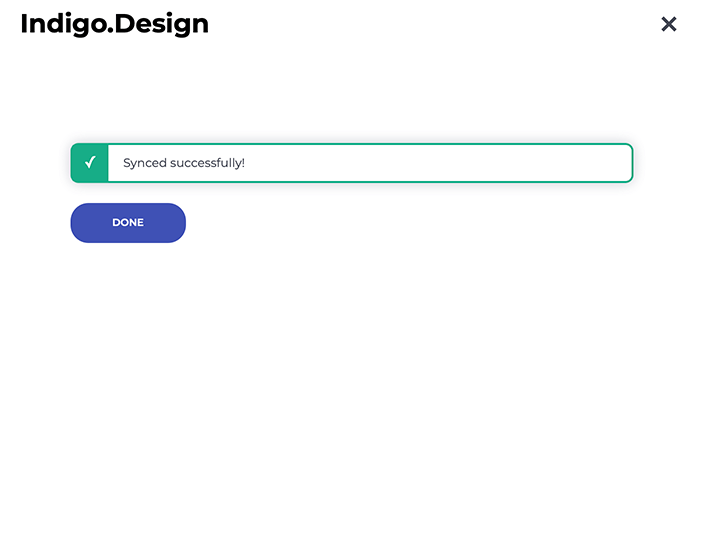

## Indigo.Design Plugin

The Indigo.Design Sketch Plugin allows users to create new themes and edit existing ones when using the Indigo.Design UI Kit. Users can adjust the `primary`, `secondary`, `error`, `success`, `warn`, and `info` colors, as well as properties of the Typography according to their brand characteristics. The plugin also lets users effortlessly publish their projects to the Indigo.Design Cloud and sync them up, when making updates thereafter.

### 1. Installing the Indigo.Design Plugin

where to [download]() from (a link to cloud homepage to make people sign up) and double click to install.

### 2. Themes with the Indigo.Design Plugin

#### Best Practices

This topic provides guidence and best practices regarding theming of Indigo.Design UI Kit according to one's brand requirements. By sticking to the recommendations below you will be able to apply your characteristic assets, such as typography and brand colors, to Indigo.Design Sketch UI kit. Thus, all UI Components will properly represent your brand.

#### Launching the Indigo.Design Plugin

The plugin can be launched from the `Plugins` menu in Sketch, under the name Indigo.Design, then select Themes. After selecting it, it will be triggered a modal window. As an end user, you can select from the provided existing themes or add a new theme.

#### Create a New Theme

If you, as an end user, want to build your theme from scratch, you have to select New Theme.

**1. Naming your New Theme**

First, you have to specify Theme name, then edit Colors and Typography properties.

**2. Specify colors**

You can specify Primary.500 and Secondary.500 (you can apply your brand colors here) and their shades will be generated automatically. In order to edit a color, you have to click on it and type the HEX or RGB value or select color manually from the color palette. As to Warning, Info, Error, Success colors, we strongly recommend to take in mind the perception of the application user for Warning, Info, Error, Success use cases. That's why we provided default colors, which we find meaningful for the cases that are going to be used.

**3. Specify typography**

As to the font the user can define font properties from the Typography tab. First, has to be selected Base Typaface from the font menu, then define font weight for the provided text styles. These text styles are applied not only to the text fields, but also on components such as chips, inputs, avatars and many others. The user is restricted from editing the font size, because of the negative impact that it may have on the components using some of these font styles.

**4. Saving and Applying your New Theme**
Finally, you have to select Save and Apply, which will result in saving your theme in the list of predefined themes and applying it for the current session.

#### Use existing theme

Instead of starting your own theme, you can also use some of the existing themes provided or added by you, as an user. You can directly apply the theme, edit it before using or delete it.

**Editing theme name, colors and typography**

If you choose to edit the existing theme before applying, you are allowed to rename the theme and edit its default Primary and Secondary color and Typography according to your needs. Editing theme name, Primary, Secondary colors and Typography are the same as editing these properties in New Theme.

> [!Note]
> Always check whether your brand colors (applied on Primary and Secondary color options) and their shades are visually different enough from Warning, Info, Error and Success colors.
>
> 

### 3. Publish and syncing prototype to the cloud with the Indigo.Design Plugin

When you, as an end user, are ready to publish your design to Indigo.Design cloud, you have to go to the Sketch plugin menu and select Indigo.Design, then Publish prototype. You will be asked to log in to your Indigo.Design account or create a new one. When logged in, you have to select whether to create a new prototype or replace existing one. 

**1. Publishing new prototype**

When logged in your Indigo.Design account, you will be asked to choose whether to create a new prototype or replace existing one where the current design will be published. On the **New prototype** tab, the user will be asked to:
- choose screen size type for his current prototype, depending on the device for which the design was made
- whether the prototype is Personal or Team owned and managed; if it belongs to a Team, then you have to specify which team
- next the user has to give name for that prototype; by default the name is set to the name of the artboard (of the current design)
- fourth step, which is not required, is to write a short brief description
- as a user you can also set a Password in the next step
- finally the user has options to select whether Hotspots and interactions to be highlighted and whether to allow comments on the design.
Finally the user has to select Publish. 

**2. Replace existing prototype**

Instead of publishing new prototype, the user may select overriding (replacing) an existing prototype. Then, he has to select the second tab **Replace prototype**. 
Prototypes here can be filtered - whether they are Personal or belongs to a Team. In addition, there is a search input provided. More options action (on the right of each prototype thumbnail) gives the user options to:
- choose screen size type for his current prototype, depending on the device for which the design was made
- rename the prototype
- whether the prototype is Personal or Team owned and managed
- write a short brief description
- set a password
- edit the review and commenting options 
After the user chooses the prototype that would be replaced, he has to select Publish.

**3. Completed publishing of prototype**

After selecting **Publish**, you will be shown the link of your prototype in the Indigo Cloud plus options to:
- view it workspace - you can view your prototype in the Indigo Cloud (in a browser window)
- create usability study - from here, you can start Usability Study in the Indigo Cloud (opened in a browser window)
- copy the Indigo Cloud link of your prototype 
- finish the publishing process by selecting Done which closes the plugin dialog

**4. Syncing with Indigo.Design cloud**

During the ongoing design process, the user may sync his prototype design with the Indigo.Cloud. In order to do this, he has to select **Sync prototype** from the plugin menu. 
 

It will open a dialog with loading indicator. When Syncing is completed, if successful a success screen will confirm it.

## Additional Resources

Related topics:

- [Colors](../style/colors.md)
- [Typography](../style/typography.md)

Our community is active and always welcoming to new ideas.
