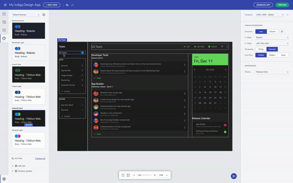
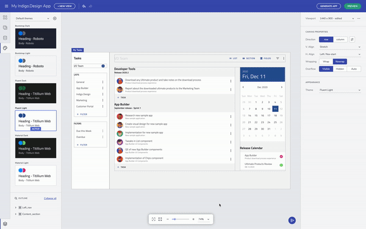
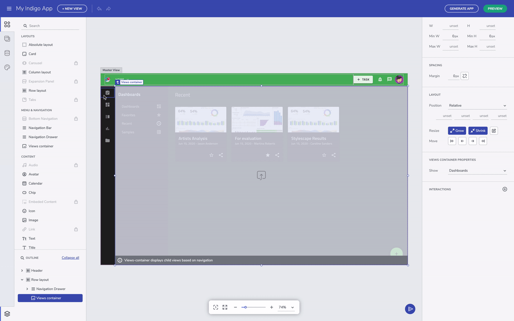

# Indigo Design App Builder テーマ

<section class="video-container">
    

        

            <iframe src="https://www.youtube.com/embed/tuTELBXDKYA" frameborder="0" allowfullscreen></iframe>
        

        
テーマをカスタマイズする

    

</section>

[Indigo Design App Builder]({environment:infragisticsBaseUrl}/products/indigo-design/app-builder) は、UI 作成にデザイン システム アプローチを採用しており、アプリ レベルでテーマを適用できます。テーマを 1 回選択するだけで、そのテーマはアプリケーション全体に即座にグローバルに適用されます。これにより、メンテナンスが難しいローカル スタイルを作成する必要がなくなります。  

## App Builder テーマを切り替える

プライベート プレビューには、Material、Fluent、または Bootstrap に基づく 6 つの組み込みテーマが付属しています。それぞれにダーク バージョンとライト バージョンがあります。ツールボックスでテーマ カードを選択すると、試すことができます。 

テーマの切り替え

## Material vs. Fluent vs. Bootstrap 

Material から Fluent に切り替えると、コンポーネントの外観が異なることがわかります。たとえば、Material の入力フィールドのフローティング ラベル スタイルは、固定ラベルに切り替わります。また、スイッチも視覚的に異なります。ツールボックスでテーマ カードを選択すると、試すことができます。 

## テーマをカスタマイズして適用する 

ブランドに合わせてカスタム テーマを作成できます。これを行うには、新しいテーマを作成し、基本テーマの 1 つを開始点として選択します。カラー パレットは、選択したプライマリ カラーとセカンダリ カラーに基づいて自動的に生成されます。タイポグラフィに関しては、今のところフォントのセットが組み込まれていますが、将来のバージョンではよりクリエイティブなコントロールを追加する予定です。編集が完了したら、テーマを保存して変更を適用します。 

新しいテーマを作成する

テーマの切り替え

テーマを選択した後、コンテナに塗りつぶしの色を適用すると、カラー ピッカーは選択したテーマのパレットを反映します。これにより、ブランド属性がアプリ レベルで決定および維持され、UI の作成者に応じてアドホック ベースで決定されるのではなく、デザイン システムのアプローチに忠実であり続けることができます。

レイアウトの外観を変更する

将来的には、カスタム カラーを追加する方法も含まれる予定ですが、二次的な使用シナリオとなります。エディターで作成したアプリ レベルのテーマは、アプリの生成時にプラットフォームに準拠した方法で保持されます。また、将来的にテーマを変更するのも非常に簡単になります。  

## その他のリソース

* [Flex レイアウト](../flex-layouts/flex-layouts.md)
* [Ignite UI for Angular テーマ化]({environment:infragisticsBaseUrl}/products/ignite-ui-angular/angular/components/themes/index)
