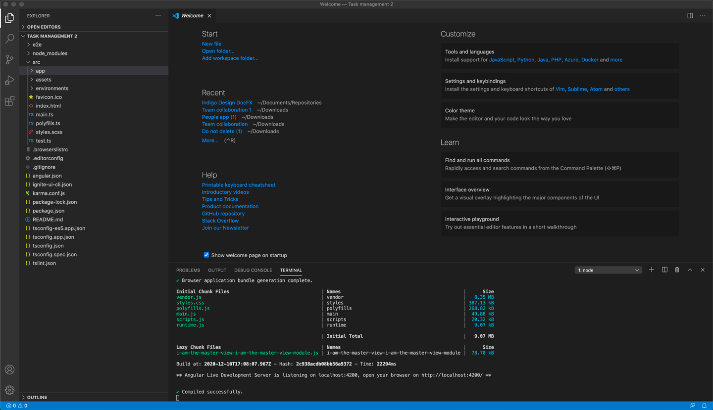

# アプリケーションをローカルで実行する

> [!NOTE]
><b>アプリケーション ファイルはパッケージとしてダウンロードして、お好みの IDE で実行できます。

### トピック コンテンツ:
* <a href="#Run-the-app-locally">アプリをローカルで実行する</a>

### アプリをローカルで実行する
最終的にアプリを開発するために、コードをコピーしてを貼り付ける必要はありません。代わりに、ツールバーの [アプリの生成] ボタンを使用してください。これにより、ダウンロード可能な Angular アプリケーションを含むパッケージがすばやく作成されます。このアプリを実行するには、Visual Studio Code のような IDE でフォルダーを開きます。

* Node.js がインストールされていることを確認してください。 
* 次に、コンソールで `npm install` と入力して依存関係をインストールします。必要なすべてのパッケージをインストールするのに時間がかかる場合があります。 
* それが完了したら、`npm start` と入力して、アプリをコンパイルして起動します。 
 
 

VS Code で実行されるアプリケーション

App Builder を使用すると、プロ級の Ignite UI コンポーネントを使用してアプリケーションを視覚的にデザインできます。その後、選択した IDE で開発を継続できる Angular アプリケーションとしてコードを生成できます。最終的に、App Builder のデザイン画面でデザインしたものは、アプリが生成およびビルドされたときにまったく同じに見えることが保証されます。フィードバック ボタンを使用してフィードバックをお気軽にお知らせください。今後のリリース マイルストーンに向けて、お客様の経験と、お客様にとって価値のある機能についてお聞かせください。 

## その他のリソース

* [アプリケーションを GitHub にアップロードする](upload-application-to-github.md)
* [アプリケーション コードのプレビュー](../../appbuilder/preview-code.md)
