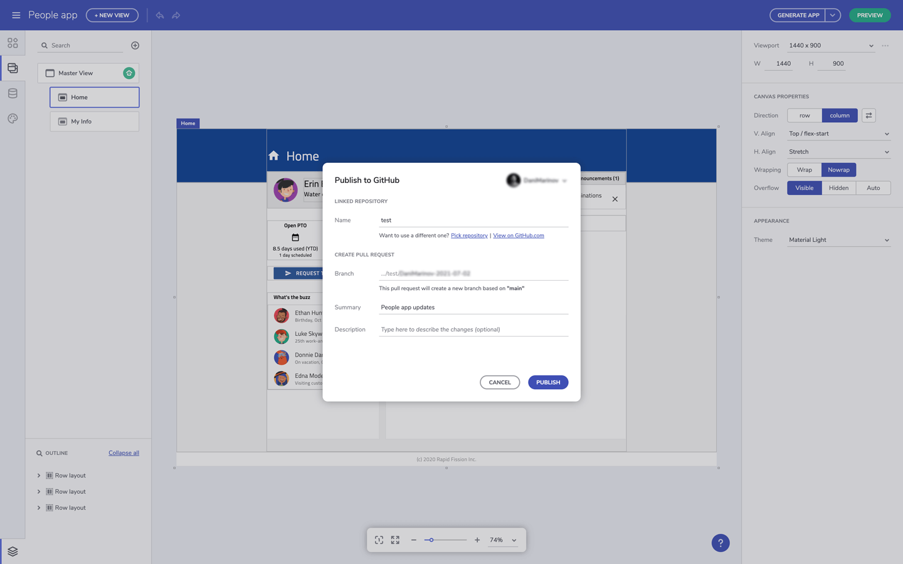

# アプリケーションを Github にアップロードする

> [!NOTE]
><b>Indigo.Design App Builder でデザインの準備ができたら、非公開または GitHub リポジトリにアップロードできます。 

### トピック コンテンツ:
* <a href="#intro">はじめに</a>
* <a href="#uploading-an-application-to-github">アプリケーションを Github にアップロードする</a>

## はじめに
Indigo.Design App Builder の優れた機能の 1 つに、コード生成サービスがあります。アプリ デザインを完成させ、コードをレビューすると、ユーザーは最終的なアプリケーションコードを取得できます。アプリ コードを App Builder 内から直接 GitHub リポジトリに簡単にアップロードできるため、エクスペリエンスがさらに向上します。GitHub は開発者に人気のあるツールで、App Builder 機能を使用すると、レビューアーの割り当て、変更の追跡、コメントなど、すべての GitHub 機能を利用できます。この機能を提供することにより、Indigo.Design 製品チームはデザインからコード作成へのコラボレーションのストーリーにさらに 1 つの要素を追加するだけでなく、App Builder プラットフォームを、エンジニアに馴染みのある有名なサービスと統合しました。 

## アプリケーションを Github にアップロードする
アプリケーションのデザインを完了し、そのコードをプレビューした後、完全なアプリ コード リポジトリを生成します。これを行うには、[アプリの生成] ボタンに移動し、GitHub アカウントを App Builder に接続します。ボタン メニューからアプリケーション ファイルをダウンロードすることもできます。

Indigo.Design App Builder を GitHub に接続する

GitHub アカウントでログインした後、Indigo.Design にアクセスしてアプリ コードが保存されるリポジトリを取得する必要があります。ここで、新しいリポジトリの作成または既存のリポジトリへの追加を選択できます。新しいリポジトリを作成する場合、アプリの名前を指定し、説明を追加して公開または非公開リポジトリを選択できます。準備ができたら、アプリのファイルを GitHub にアップロードし、新しい GitHub リポジトリを作成します。

アプリケーションを GitHub の既存のリポジトリに公開する

GitHub に新しいリポジトリを作成する

アップロード プロセスが完了したら、ユーザーは App Builder 内から GitHub リポジトリに変更を適用するか、[GitHub で表示] をクリックして GitHub で更新されたファイルを表示できます。

VSCode で実行されるアプリケーション

## その他のリソース

* [アプリケーションをローカルで実行する](run-application-locally.md)
* [アプリケーション コードをプレビューする](../../appbuilder/preview-code.md)
