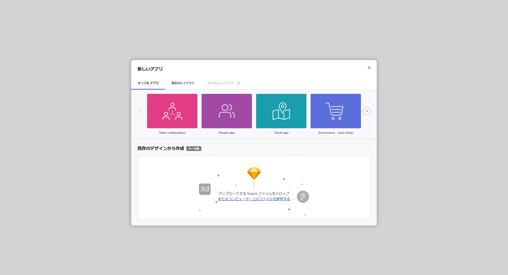
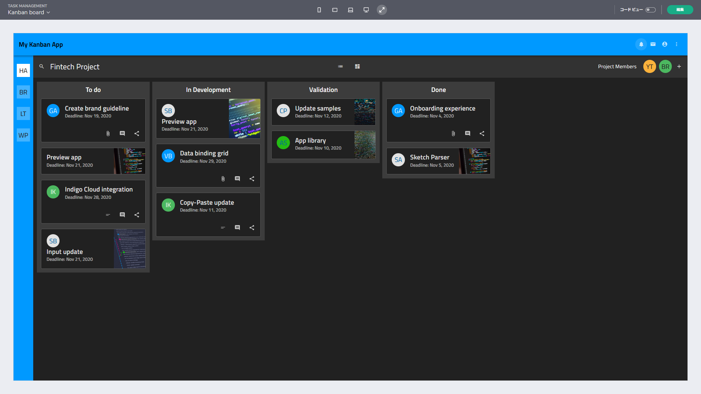

# Indigo Design App Builder を使用した作業の開始

> [!NOTE]
><b>Indigo Design App Builder as a member of the Indigo.Design family can be accessed from the Indigo.Design home screen. From here, users can start a new app, preview or edit already created one. Once users are in the tool, they can easily switch between their other app projects, edit and preview it, or code generate the its code.

### In this article:
* <a href="#launch">Launch App Builder from Indigo.Design</a>
* <a href="#Getting-the-code">Getting the code</a>
* <a href="#Running-the-app-locally">Interaction: Open/Close</a>

<section class="feature__container">
    

        

            <iframe width="800" height="450" src="https://www.youtube.com/embed/DK50La2GFJ0" frameborder="0" allowfullscreen></iframe>
            
App Builder を使用した作業の開始

             
        

    

</section>

[Indigo Design App Builder]({environment:infragisticsBaseUrl}/products/indigo-design/app-builder) を初めて起動したときに表示されるのは、簡単なオンボーディング ツアーを提案するポップアップ ウィンドウです。次に表示されるのは、[New Project] の作成ダイアログです。事前に定義されたレイアウトの 1 つを使用するか、構築済みの入門アプリの 1 つを編集できます。入門アプリは、Indigo Design App Builder を使用して作成されたアプリケーションを探索するのに役立ち、独自のユーザー スペースでそれらを変更することもできます。また、独自のアプリを最初から作成しなくても、より大きなアプリケーション用に生成されたコードをプレビューするための優れたソースです。Indigo Design App Builder を初めて使用する場合は、Sample Apps オプションを開始点として使用することをお勧めします。これは、ツールのすばらしい機能を利用してアプリケーションの構築を開始するための最も簡単な方法です。  

[New Project] ダイアログ

## コードの取得
Indigo Design App Builder は、常にライブ実行中の Web アプリケーションをデザイン画面とプレビュー ウィンドウの両方に表示します。基になるコードとアプリケーション モデルは、デザイン画面でアプリケーションに変更を加えると、リアルタイムで更新されます。生成されたアプリケーション コードはプレビュー ウィンドウでいつでも表示できます。また、生成されたアプリケーションを完全なアプリケーション コード リポジトリとしてダウンロードして、選択したコード エディターで開くこともできます。次に、Indigo Design App Builder を使用してデザインしたアプリケーションをマシン上でローカルにビルドして実行し、生成されたコードに追加の変更を加えることができます。
 

アプリケーション プレビュー ウィンドウ

生成されたアプリケーションのコードを VScode で実行する

> [!NOTE]
> アプリケーションのコードがダウンロードされると、ローカルで行われた変更は Indigo Design AppBuilder ユーザー スペースに反映されません。

## アプリをローカルで実行する

ダウンロードしたアプリケーションを実行するには、次の前提条件がマシンにインストールされている必要があります:

1. NodeJS。
2. Visual Studio Code (VS Code をお勧めしますが、別のコード エディターを使用することもできます)。

    

      
      <a target="_blank" href="https://nodejs.org/en/download/" class="no-external-icon"
         style="color:white;background-color:#09f;text-decoration:none;font-weight:700;font-size:16px;padding: 5px 15px 5px 15px;">
        NODE のダウンロード
      </a>
    

    

      
      <a target="_blank" href="https://code.visualstudio.com/download" class="no-external-icon"
         style="color:white;background-color:#09f;text-decoration:none;font-weight:700;font-size:16px;padding: 5px 15px 5px 15px;">
        VS CODE のダウンロード
      </a>
    

## その他のリソース

* [App Builder インターフェイスの概要](interface-overview.md)