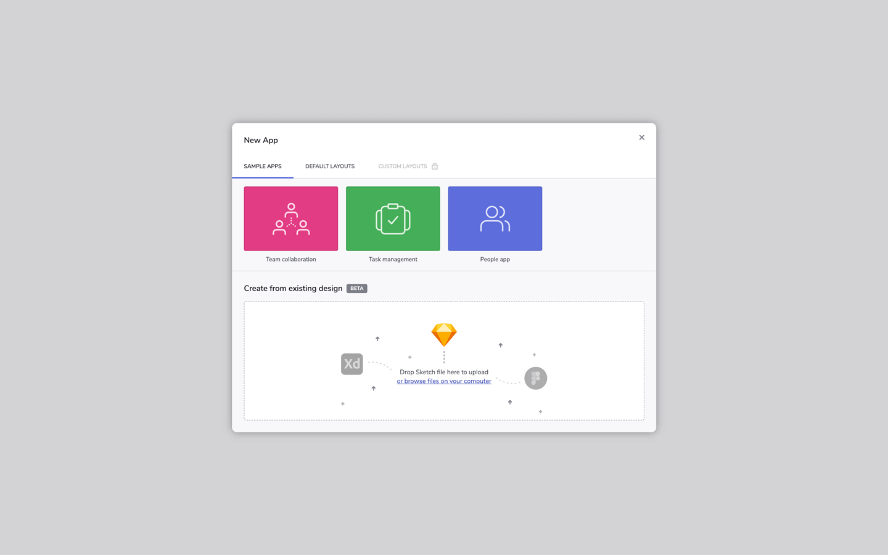

# Indigo Design App Builder を使用した作業の開始

> [!NOTE]
><b>Indigo Design App Builder can be launched from the App tab in your Indigo.Design home screen. From there, you will be able also to manage all of your active applications. Once, you finish editing an app in the App Builder, you can generate its code from the "Generate code" button and, then, run it locally.

### トピック コンテンツ:
* <a href="#launch-app-builder-from-indigodesign">Indigo.Design から App Builder を起動する</a>
* <a href="#getting-the-code">コードの取得</a>
* <a href="#running-the-app-locally">アプリをローカルで実行する</a>

<section class="feature__container">
    

        

            <iframe width="800" height="450" src="https://www.youtube.com/embed/DK50La2GFJ0" frameborder="0" allowfullscreen></iframe>
            
App Builder を使ってみましょう

             
        

    

</section>

## Indigo.Design から App Builder を起動する
Once you sign in Indigo.Design, you will land in the home screen and from here you can access each of the three core Indigo.Design products - Prototypes and Usability Tests, as well as the newest one - App Builder which can be found under the Apps tab. From the App Builder home screen in Indigo.Design, users can start a new app, preview or edit an existing one. Through the context menu, every existing app can also be renamed, duplicated or archived.  

Indigo.Design ホーム画面

[Indigo Design App Builder]({environment:infragisticsBaseUrl}/products/indigo-design/app-builder) を初めて起動したときに表示されるのは、簡単なオンボーディング ツアーを提案するポップアップ ウィンドウです。次に表示されるのは、[New Project] の作成ダイアログです。 There are four ways to start a new app:
1. <b>Create from existing design</b> - if you have an existing Sketch file, created using the Indigo.Design UI kit for Sketch, you can upload it at this point and continue your design in the App Builder, without the need to recreate everything from scratch. Note, that due to the differences between the absolute layout in Sketch and the Flex layout in the App Builder, some additional adjustments may be needed after parsing your Sketch file.
2. <b>Sample apps</b> - the getting started apps will help you explore applications that have been created using the Indigo Design App Builder and also allow you to modify them in your own user space. また、独自のアプリを最初から作成しなくても、より大きなアプリケーション用に生成されたコードをプレビューするための優れたソースです。Indigo Design App Builder を初めて使用する場合は、[Sample Apps] オプションを開始点として使用することをお勧めします。これは、ツールのすばらしい機能を利用してアプリケーションの構築を開始するための最も簡単な方法です。
3. <b>Defaul layouts</b> - start a new app from scratch, benefiting from a basic predefined layout.
4. <b>Blank</b> - start a new app from scratch.

[新しいプロジェクト] ダイアログ

Note, that once in the App Builder, users are enabled to easily switch between their active applications or go back to their workspace in Indigo.Design from the in-app side menu at design time without leaving the App Builder.

サイド メニュー

## コードの取得
Indigo Design App Builder は、常にライブ実行中の Web アプリケーションをデザイン画面とプレビュー ウィンドウの両方に表示します。基になるコードとアプリケーション モデルは、デザイン画面でアプリケーションに変更を加えると、リアルタイムで更新されます。生成されたアプリケーション コードはプレビュー ウィンドウでいつでも表示できます。また、生成されたアプリケーションを完全なアプリケーション コード リポジトリとしてダウンロードして、選択したコード エディターで開くこともできます。次に、Indigo Design App Builder を使用してデザインしたアプリケーションをマシン上でローカルにビルドして実行し、生成されたコードに追加の変更を加えることができます。
 

アプリケーション プレビュー ウィンドウ

生成されたアプリケーションのコードを Vscode で実行する

> [!NOTE]
> アプリケーションのコードがダウンロードされると、ローカルで行われた変更は Indigo Design AppBuilder ユーザー スペースに反映されません。

## アプリをローカルで実行する

ダウンロードしたアプリケーションを実行するには、次の前提条件がマシンにインストールされている必要があります:

1. NodeJS.
2. Visual Studio Code (VS Code をお勧めしますが、別のコード エディターを使用することもできます）。

    

      
      <a target="_blank" href="https://nodejs.org/en/download/" class="no-external-icon"
         style="color:white;background-color:#09f;text-decoration:none;font-weight:700;font-size:16px;padding: 5px 15px 5px 15px;">
        NODE のダウンロード
      </a>
    

    

      
      <a target="_blank" href="https://code.visualstudio.com/download" class="no-external-icon"
         style="color:white;background-color:#09f;text-decoration:none;font-weight:700;font-size:16px;padding: 5px 15px 5px 15px;">
        VS CODE のダウンロード
      </a>
    

## その他のリソース

* [App Builder インターフェイスの概要](interface-overview.md)
* [単一ページとナビゲーション](single-page-apps-and-navigation.md)
* [Indigo.Design App Builder コンポーネント](indigo-design-app-builder-components.md)
* [Flex レイアウト](flex-layouts/flex-layouts.md)
