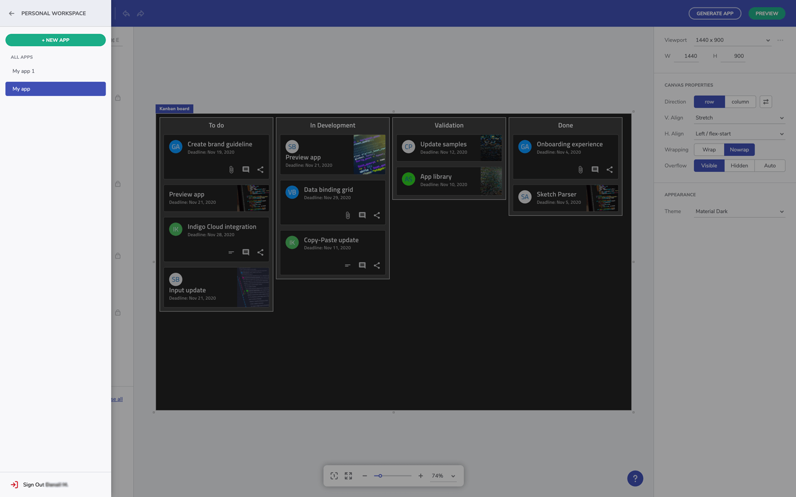

# Indigo Design App Builder を使用した作業の開始

> [!NOTE]
><b>Indigo Design App Builder は、Indigo.Design ホーム画面の [アプリ] タブから起動できます。そこから、すべてのアクティブなアプリケーションを管理することもできます。App Builder でアプリの編集が完了したら、[コードの生成] ボタンからコードを生成し、ローカルで実行します。

### トピック コンテンツ:
* <a href="#launch-app-builder-from-indigodesign">Indigo.Design から App Builder を起動する</a>
* <a href="#getting-the-code">コードの取得</a>
* <a href="#running-the-app-locally">アプリをローカルで実行する</a>

<section class="feature__container">
    

        

            <iframe width="800" height="450" src="https://www.youtube.com/embed/DK50La2GFJ0" frameborder="0" allowfullscreen></iframe>
            
App Builder を使ってみましょう

             
        

    

</section>

## Indigo.Design から App Builder を起動する
OIndigo.Design にサインインすると、ホーム画面が表示されます。ここから 3 つの主要な Indigo.Design 製品 (プロトタイプとユーザビリティ テスト)、および最新の App Builder ([アプリ] タブ) にアクセスできます。Indigo.Design の App Builder のホーム画面から、ユーザーは新しいアプリを起動し、既存のアプリをプレビューまたは編集できます。コンテキスト メニューを使用して、既存のアプリを名前変更、複製、またはアーカイブすることもできます。  

Indigo.Design ホーム画面

[Indigo Design App Builder]({environment:infragisticsBaseUrl}/products/indigo-design/app-builder) を初めて起動したときに表示されるのは、簡単なオンボーディング ツアーを提案するポップアップ ウィンドウです。次に表示されるのは、[新しいプロジェクト] の作成ダイアログです。新しいアプリを開始する方法は 4 つあります:
1. <b>既存のデザインから作成</b> - Sketch の Indigo.Design UI キットを使用して作成された既存の Sketch ファイルがある場合、この時点でアップロードして App Builder でデザインを続行できます。Sketch の絶対レイアウトと App Builder の Flex レイアウトの違いにより、Sketch ファイルの解析後に追加の調整が必要になる場合があります。
2. <b>サンプル アプリ</b> - 入門アプリは、Indigo Design App Builder を使用して作成されたアプリケーションを探索するのに役立ち、独自のユーザー スペースでそれらを変更することもできます。また、独自のアプリを最初から作成しなくても、より大きなアプリケーション用に生成されたコードをプレビューするための優れたソースです。Indigo Design App Builder を初めて使用する場合は、[Sample Apps] オプションを開始点として使用することをお勧めします。これは、ツールのすばらしい機能を利用してアプリケーションの構築を開始するための最も簡単な方法です。
3. <b>既定のレイアウト</b> - 定義済みの基本レイアウトを使用して新しいアプリケーションを作成します。
4. <b>Blank (空白)</b> - 新しいアプリを最初から作成します。

[新しいプロジェクト] ダイアログ

注: App Builder にアクセスすると、デザイン時に App Builder を終了せずに、アプリ内のサイド メニューからアクティブなアプリケーションを簡単に切り替えたり、Indigo.Design のワークスペースに戻ることができます。

サイド メニュー

## コードの取得
Indigo Design App Builder は、常にライブ実行中の Web アプリケーションをデザイン画面とプレビュー ウィンドウの両方に表示します。基になるコードとアプリケーション モデルは、デザイン画面でアプリケーションに変更を加えると、リアルタイムで更新されます。生成されたアプリケーション コードはプレビュー ウィンドウでいつでも表示できます。また、生成されたアプリケーションを完全なアプリケーション コード リポジトリとしてダウンロードして、選択したコード エディターで開くこともできます。次に、Indigo Design App Builder を使用してデザインしたアプリケーションをマシン上でローカルにビルドして実行し、生成されたコードに追加の変更を加えることができます。
 

アプリケーション プレビュー ウィンドウ

生成されたアプリケーションのコードを VS Code で実行する

> [!NOTE]
> アプリケーションのコードがダウンロードされると、ローカルで行われた変更は Indigo Design App Builder ユーザー スペースに反映されません。

## アプリをローカルで実行する

ダウンロードしたアプリケーションを実行するには、次の前提条件がマシンにインストールされている必要があります:

1. NodeJS.
2. Visual Studio Code (VS Code をお勧めしますが、別のコード エディターを使用することもできます)。

    

      
      <a target="_blank" href="https://nodejs.org/en/download/" class="no-external-icon"
         style="color:white;background-color:#09f;text-decoration:none;font-weight:700;font-size:16px;padding: 5px 15px 5px 15px;">
        NODE のダウンロード
      </a>
    

    

      
      <a target="_blank" href="https://code.visualstudio.com/download" class="no-external-icon"
         style="color:white;background-color:#09f;text-decoration:none;font-weight:700;font-size:16px;padding: 5px 15px 5px 15px;">
        VS CODE のダウンロード
      </a>
    

## その他のリソース

* [App Builder インターフェイスの概要](interface-overview.md)
* [単一ページとナビゲーション](single-page-apps-and-navigation.md)
* [Indigo.Design App Builder コンポーネント](indigo-design-app-builder-components.md)
* [Flex レイアウト](flex-layouts/flex-layouts.md)
