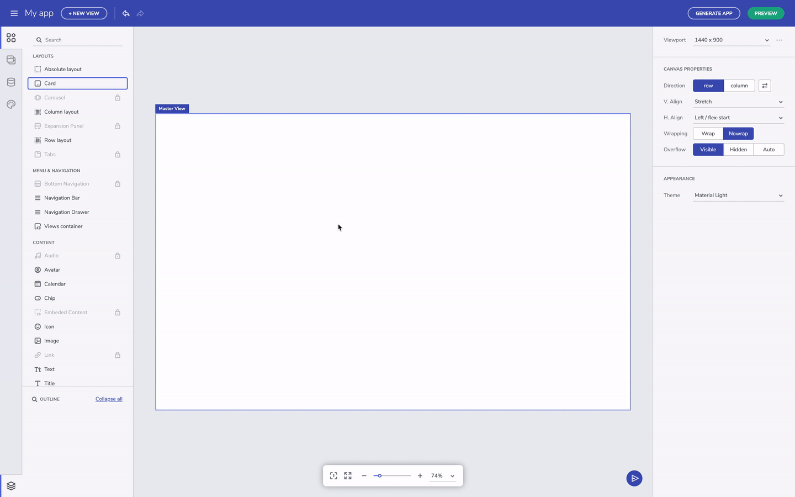
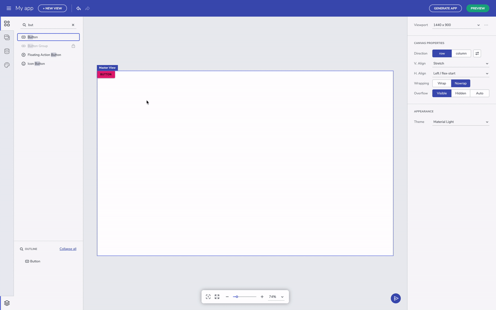

# Indigo Design コンポーネント

<section class="feature__container">
    

        

            <iframe width="800" height="450" src="https://www.youtube.com/embed/omlSzOuvFlM" frameborder="0" allowfullscreen></iframe>
            
Indigo.Design コンポーネントの使用

             
        

    

</section>

左側の**ツールボックス** タブでは、使用可能なすべての [Ignite UI for Angular]({environment:infragisticsBaseUrl}/products/ignite-ui-angular) のリストと、絶対、行、列のレイアウト、ビュー コンテナなどの [Indigo.Design]({environment:infragisticsBaseUrl}/products/indigo-design) の一般的なコンポーネントを順番に表示できます。コンポーネント リストの上部にある検索入力により、特定のコンポーネントを簡単に見つけることができます。すべてのコンポーネントは、使用法に基づいてグループに簡単に分散されます。グレーアウトされたコンポーネントはまだ追加されていないため無効になっていますが、間もなく次のアップデートで利用できるようになります。コンポーネントは、**ツールボックス**からドラッグアンドドロップすることで**デザイン キャンバス**に追加できます。

## クイック追加のコンポーネント 

Mac でキーボード ショートカットの ctrl + E または cmd + E を使用してコンポーネントを検索および追加することにより、クイック追加機能を使用することもできます。「E」 はすべてを表すことを覚えておいてください。クイック追加は、最近使用したコンポーネントを追跡し、頻繁に使用するコンポーネントをすばやく追加できるようにします。**ツールボックス**でコンポーネントをダブルクリックすると、そのコンポーネントも**デザイン キャンバス**に追加されます。  

コンポーネントのクイック追加

## コンポーネントの構成 

すべてのコンポーネントには、Indigo.Design システムに一致する一連のプリセット タイプが付属しています。たとえば、Indigo.Design システムには、Raised、Outline、Flat の 3 つのプリセット タイプのボタンがあります。

コンポーネントのプリセット

入力フィールドやカード コンポーネントなどのより複雑なコンポーネントの場合は、コンポーネントのセクションをオン/オフにすることができます。また、コンポーネントのプロパティはコンポーネントの視覚的な構造も反映しており、[Ignite UI for Angular]({environment:infragisticsBaseUrl}/products/ignite-ui-angular) などの開発者ツールキットにある仕様と一致します。入力フィールドの場合、プレフィックス セクションを有効または無効にして、先頭のアイコンを追加できます。 

コンポーネントのプロパティをオフにする

## その他のリソース

* [テーマ](app-themes/app-themes.md)