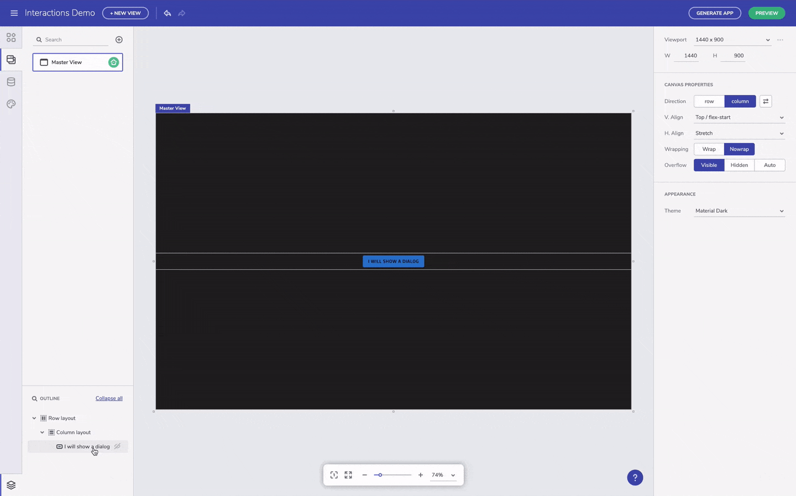

# Interactions

> [!NOTE]
><b>The Interactions feature of the Indigo.Design App Builder enables users to define particular interactions between views and components, such as Navigate to another view, Show or Hide and Open or Close an app component.

### In this article:
* <a href="#intro">Introduction of the feature</a>
* <a href="#navigate-to">Interaction: Navigate to</a>
* <a href="#openclose-interaction">Interaction: Open/Close</a>
* <a href="#showhide">Interaction: Show/Hide</a>
* <a href="#additional-resources">Additional Resources</a>

<section class="feature__container">
    

        

            <iframe width="800" height="450" src="https://www.youtube.com/embed/zxT-nIXKn7I" frameborder="0" allowfullscreen></iframe>
            
Interaction feature introduction

             
        

    

</section>

## Intro
Indigo.Design App Builder enables its users not only to design application layouts and screens, but also to define the application interaction design. Interactions can be set up between components and views or just between components. Through this feature particular application scenarios, such as showing and hiding a calendar component triggered upon click on a button component, can be established. This will help users build great UX flows according to the needs of their customers. All added interactions will be available not only in Preview mode, but also in the application code after generating it.
In order to add an interaction, first select the component that will trigger the action, then go to the Property panel in the right side of the Indigo.Design App Builder interface and scroll down to the Interactions. Then, select the + icon button to create a new interaction. Upon this, a new interaction will be created below where first has to be picked up the interaction type, then the target component or view. No more than one interaction can be added to a component. Created interactions can be tested on Preview Mode, as well as deleted or edited from the Interactions panel. Check below detailed description about how to use each one of the interactions.

## Navigate to
"Navigate to" is the most straight-forward and basic interaction which allows users to set up a connection from a component navigating to selected by the user child or master view. Simply pick up a component, create an interaction for it and pick up the destination view. Note that during design time, no visual changes will be introduced to the components or views with an interaction. 

"Navigate to" interaction

## Open/Close interaction
The Open/Close interaction targets only overlay components, such as Dialog. This means that in order to use it, initially a triggering component, e.g. a button and then an overlay component, e.g. a Dialog, have to be added in the design area. Using the button and dialog example, next step is to select the button, go to Interactions panel and select Open/Close interaction. Once the trigger and the overlay are available, the Open/Close interaction is unlocked and the user can pick the Dialog to be opened upon selection of the button. 

"Open/Close" interaction

Note that once a Dialog component is added, an overlay notification will be appear next to the name of the active view in the design area. By clicking on the the overlay, just pick up one of the available overlays and it will be actived. Then, it can be edited according to your application scenario. 

## Show/Hide 
"Show/Hide" is an interaction that can be applied to a component to show and hide another component visibility in the same view. Similar to the other interactions, first has to be selected a component that triggers the interaction, then the targeted component (the one that shows and hides). Picking up the targeted component can be done upon selecting the target icon (next to the active interaction). This will change your mouse cursor to a target icon and then you are expected to click on the component that will show and hide. Once a target component is selected, the cursor goes back to regular. If you want to cancel targeting a component, simply click ESC. Note that targeting is enabled only when the cursor is over components on which the interaction can be applied and this interaction cannot be applied on a layout component or a whole view. In order to check the applied interaction, you can go and test it in Preview mode.

"Show/Hide" interaction

Note that we are constantly updating the Indigo.Design App Builder with new interactions, but also improving the user experience of the existing ones. If you have question or suggestions for improvement, do not hesitate to contact our product support.

## Additional Resources

* [Single Page Apps and Navigation](single-page-apps-and-navigation.md)
* [Angular Routing](https://angular.io/start/start-routing)