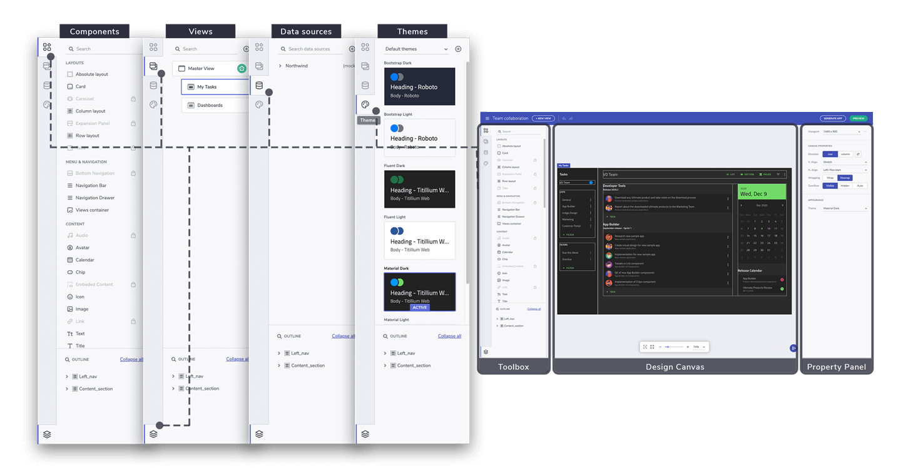

# インターフェイスの概要 

Indigo App Builder のインターフェースは、すでに慣れているほとんどのデザイン ツールのインターフェースに似ていますが、多少違いがあります。しかし、すぐにそれに慣れるでしょう。
Indigo Design AppBuilder には 4 つの主要なセクションがあります。

インターフェース画面パーツ

## ツールボックス 

**ツールボックス**は左側のセクションであり、**[コンポーネント]、[ビュー]、[データ]、[テーマ]**、および **[アウトライン]** 用の 5 つのタブが含まれています。[コンポーネント] タブでは、使用可能なすべての Ignite UI for Angular コンポーネントに加えて、Absolute、Row、Column layout、Views container などの Indigo Design App Builder の一般的なコンポーネントにアクセスできます。コンポーネント リストの上部にある検索入力により、特定のコンポーネントを簡単に見つけることができます。すべてのコンポーネントは、応用に基づいてグループに簡単に分散されます。グレーアウトされたコンポーネントはまだ追加されていないため無効になっていますが、まもなく将来のアップデートで実装される予定です。[コンポーネント] タブの下に、[ビュー] タブがあります。[ビュー] タブでは、親子関係で表示されるアプリケーションのすべてのビューを見つけることができます。3 番目のタブは [データ] です。これは、すべてのデータソースと関連オプションが配置されている場所です。使用可能なすべてのデータソースを表示および編集し、新しいデータソースを追加できます。4 番目のタブでは、すべてのテーマ機能と、使用可能なすべての事前構成済みテーマにアクセスできます。独自のテーマを作成および編集して、すばやく切り替えることができます。最後の [アウトライン] タブには、選択したアプリ ビューのコンポーネントの詳細な階層が表示されます。

## デザイン キャンバス

画面の中央には、アプリケーションがデザインされている**デザイン キャンバス**があります。**ツールボックス**から追加するコンポーネントをドラッグアンドドロップまたはダブルクリックするだけで、デザイン中のアプリケーション ビューの一部として**デザイン キャンバス**に表示されます。下部には、事前定義されたズーム値、実際のサイズに設定、フィットするようにズームなどの便利なオプションを備えたズーム バーが表示されます。ズーム バーの右側には [ご意見の送信] ボタンがあり、アプリのデザイン プロセスを中断することなく、Indigo Design App Builder から直接フィードバックや機能リクエストを送信できます。  

## プロパティ パネル

画面の右側には、Viewport、**デザイン キャンバス**、およびコンポーネント関連のオプションを備えた**プロパティ パネル**があります。コンポーネントを選択すると、**プロパティ パネル**のプロパティを使用して、コンポーネントのサイズ、位置、レイアウト、間隔を編集し、データ リピーターやインタラクションを追加できます。**プロパティ パネル**には、各コンポーネント タイプに固有のプロパティが表示されます。

## その他のリソース

* [Indigo Design App Builder コンポーネント](indigo-design-app-builder-components.md)