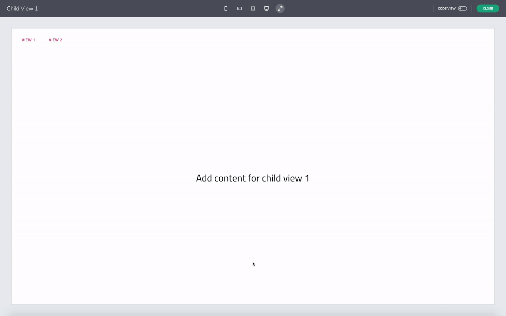

# 単一ページアプリとナビゲーション 

<section class="feature__container">
    

        

            <iframe width="800" height="450" src="https://www.youtube.com/embed/5mF15w3Ww3g" frameborder="0" allowfullscreen></iframe>
            
単一ページ アプリとナビゲーションを設定する

             
        

    

</section>

Indigo.Design App Builder のもう 1 つの機能は、単一ページのアプリとナビゲーションです。ページに基づいたデザイン アプローチとは異なり、Indigo Design App Builder では、ユーザーのナビゲート方法に基づいて挿入または切り替えられる個別のビューを作成できます。このアクションを確認するには、[+ 新しいアプリ] ボタンを使用して新しいアプリを作成し、定義された上部ナビゲーションを表示するデフォルトのレイアウトの 1 つを選択します。 

メニュー ボタンからレイアウト プリセットを追加し、[Create New App] を選択する

## 親ビュー vs. 子ビュー

ここに表示されているのは [Master View] です。また、ツールボックスの [ビュー] リストを見ると、その下に 2 つの子ビューがネストされていることがわかります。各子ビューは、プライマリ ツールバー領域のナビゲーション ボタンに対応しています。アプリをプレビューすると、[View 1] をクリックすると、[View 1] 内で利用可能なコンテンツが表示され、[View 2] でも同様に表示されます。 

ビューを切り替える - レイアウト プリセット

マスター ビューと子ビューの概念に関しては、マスター ビューはアプリのシェルを表し、すべての子ビューで共有される UI 要素を含めることができることに注意してください。この場合、ナビゲーション ツールバーとサイド ナビゲーションは共有コンポーネントです。ナビゲーションに基づいて子ビューを挿入するには、Views container と呼ばれるコンポーネントを追加してプレースホルダーとして機能させることができます。そして、これは子ビューが描画される領域です。Views container は、デフォルトで使用可能なスペースを占めます。

ビューを切り替える - サンプルアプリ

Views container には、アプリの読み込み時に 2 つの子ビューのどちらがデフォルトで表示されるかを定義するプロパティがあります。[Views container] を選択すると、Views container のプロパティから、表示されるデフォルトの子ビューを定義できます。

Views container コンポーネント - サンプル アプリ

ビューの変更の操作 - サンプル アプリ

## ナビゲーションの追加 (ルーティング) 

ナビゲーションを子ビューに接続するために、[インタラクション] セクションのボタンへナビゲーション アクションを追加できます。現在、[次へ移動]、[開く / 閉じる] および [表示 / 非表示] (Nav Drawer、Dropdown、Select などのコンポーネント用) アクションを提供していますが、将来のリリースでさらにアクションを追加する予定です。 

 
ナビゲーションを定義する - サンプル アプリ

単一ページ アプリとナビゲーション機能については以上です。要約すると、子ビューは、ナビゲート アクションに基づいて [Master View] 内に挿入されます。子ビューは、Views container コンポーネントを使用して [Master View] 内でホストされます。また、[Master View] に追加されたコンポーネントは、すべての子ビューで共有されます。

## その他のリソース

* [コードをプレビューしてアプリを生成する](preview-code-and-generate-app.md)
* [Angular ルーティング (英語)](https://angular.io/start/start-routing)